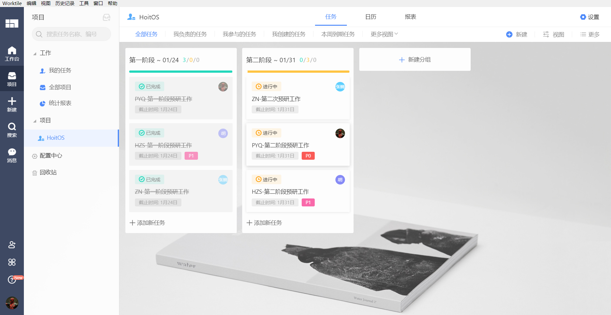

# HoitOS
> 这里是项目简介

This is the repository of 2021 OS comp， 项目进度安排移步至[Worktile](https://vwpp20210125060242436.worktile.com/mission/projects/600e62ffd6e5f843a97f2182)



## Log

> 这里记录了所有输出文档

1. [00-Prepare](./Records/Docs/00-Prepare.md)
2. [01-SettleDown](./Records/Docs/01-SettleDown.md)
3. [02-PreResearch-Part1](./Records/Docs/02-PreResearch-Part1.md)
4. [02-PreResearch-Part2](./Records/Docs/02-PreResearch-Part2.md)
5. [03-DeepResearch-Part1](./Records/Docs/03-DeepResearch-Part1.md)

## ConfigurationControlBoard(CCB)

> 这里记录了会议纪要

1. [2021-01-12](./Records/CCB/2021-01-12.md)
2. [2021-01-14](./Records/CCB/2021-01-14.md)
3. [2021-01-24](./Records/CCB/2021-01-24.md)
4. [2021-01-31](./Records/CCB/2021-01-31.md)

## Basic Develop Method

> 这里记录了利用Git开发的基本流程

**1. Get Start**

```shell
# clone project
git clone https://github.com/Hoit-23o2/HoitOS.git
```

**2. Basic Development**

```shell
# pull project
git pull origin main

...

# add some modification
git add .
# commit
git commit -m "一些描述"
# REMEMBER MUST "pull" before "push"
git pull origin main
# push
git push origin main
```

