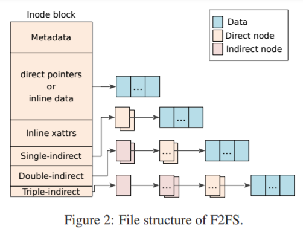
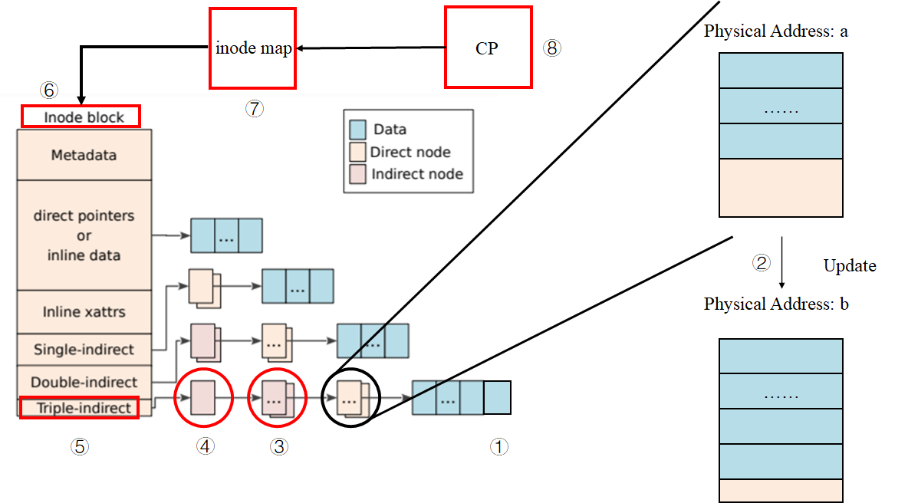
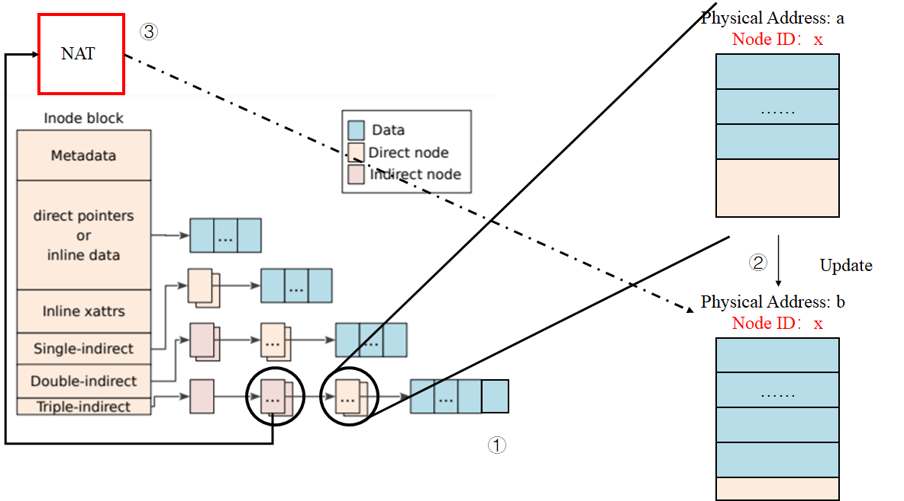
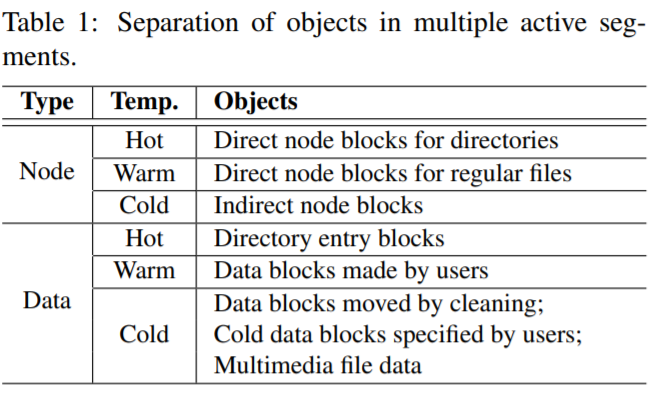

# 2021-01-26 ~ 2021-01-31 Deep Research

> 主要解决几个问题：
>
> 1. Sylix OS文件系统挂载；
> 2. Sylix IDE的智能补全机制；
> 3. JFFS（LFS）的具体操作流程；
> 4. SSD F2FS的实现方式；
>
> 参考文献：
>
> 1. [F2FS origin paper](https://www.usenix.org/system/files/conference/fast15/fast15-paper-lee.pdf)
> 2. [F2FS slides](https://www.usenix.org/sites/default/files/conference/protected-files/fast15_slides_lee.pdf)
> 3. [F2FS presentation](https://www.youtube.com/watch?v=HgCvcMQnJQ0)
> 4. [F2FS versus JFFS](https://lwn.net/Articles/519337/)
> 5. [UBIFS](http://www.linux-mtd.infradead.org/doc/ubifs_whitepaper.pdf)
> 6. [UBIFS DOC](http://www.linux-mtd.infradead.org/doc/ubifs.html#L_raw_vs_ftl)
> 7. [冷热数据分区是好是坏？](https://win.uantwerpen.be/~vanhoudt/papers/1998/PEVA2014.pdf)
> 8. [Raw Flash VS FTL Device](https://digitalcerebrum.wordpress.com/random-tech-info/flash-memory/raw-flash-vs-ftl-devices/)
> 9. [Firmware](https://hanyu.baidu.com/zici/s?wd=固件&query=什么叫固件&srcid=28204&from=kg0)
> 10. [MTD Doc](http://www.linux-mtd.infradead.org/doc/general.html)

[TOC]

## 蒋老师的回复

**Q：**

**问题一：**如何在SylixOS IDE中设置代码智能补全？

**问题二：**我们小组选择的Project 32是基于NorFlash的文件系统，在NandFlash越来越火的今天，为何还需要设计基于NorFlash的FS？

**A：**

**第一个问题：**置代码智能补全是IDE自带的功能，不需要设置的。

**第二个问题：**首先SylixOS上已经实现了时候NandFlash和硬盘等大型存储设备的文件系统，目前只差norflash文件系统没有实现。其次目前还有一些使用SylixOS工控及电力等设备用到了norflash，同样也有文件系统需求。另外实现一个norflash在功能上和其它设备的文件系统差不多，也就是说对于题目的学习目的来说并没有多少变化。**（工程需求、完整性需求）**

**Q：**

**针对第一个问题的回复：**我们录了一个视频，放在了附件里，确实没有看到智能补全；

**针对第二个问题的回复：**我们还想了解一下，既然本次大赛Norflash FS是要应用于工业领域，那么本项目的着力点是在norflash fs的性能上还是其可靠性上？还是两者兼具呢？

**A：**

**第一个问题：**eclipse下的智能补全和vs下的不一样，有的（如全局函数）补齐需要你按ALT+/ 键。如果是结构体，在你输入.或者->之后会自动补齐成员。

**第二个问题：**首先是要实现功能，然后肯定是必须关心可靠性，之后才是效率。我们题目要求里面有掉电安全和写平衡需求，其实也是对可靠性要求的体现。**（功能 > 可靠性 > 效率）**

工欲善其事必先利其器，没有Intellisense可太难受了。于是，写了一个简单的脚本来实现Sylix IDE类似VS的代码补全功能，这里是[工具链接](../../Tools/auto_complete.py)。使用方法很简单，打开Sylix IDE后，在代码编辑界面打开该脚本；在没有编辑代码的时候关闭此脚本即可。

## F2FS

### F2FS 轮廓
首先需要明白F2FS与JFFS之间的区别。事实上，二者**没有可比性**。因为F2FS把Flash设备看作块设备，利用FTL（Flash Translation Layer）技术；而JFFS是直接由Flash的特点设计而来。

这里有一个很有趣的问题。

在JFFS2的presentation中，作者认为利用FTL是一个**很烂**的选择。

这里值得一提的是，F2FS的诞生在2012年左右，而JFFS2在2001年左右就已经诞生。

下面是[F2FS versus JFFS](https://lwn.net/Articles/519337/)中的两条回复：

> 1. It is designed for flash devices that expose themselves as block devices (like SSDs) and not for raw flash devices as jffs2 .. so they aren't really comparable.
>
> 2. And JFFS2 works really **badly on file systems which sizes are in GBs** as it AFAIK **keeps the whole fs structure in RAM**. From scalability point of view, **UBIFS** would be more reasonable comparison.

也许在进一步深入F2FS之前还应该去阅读UBIFS。

> The big difference between JFFS2 and UBIFS is that UBIFS stores the index on flash whereas JFFS2 stores the index only in main memory, rebuilding it when the file system is mounted.

点到为止，还有更多的工作需要完成，翻译工作将在后续进行。

**从Presentation来看**，F2FS主要特点是：

1. 基于特殊FTL，该FTL能够根据规则翻译物理地址（zone 2 zone mapping）。根据后面的QA环节可以直到，这种FTL是由**三星**自研的。

   

2. 冷热数据分区。其规则是：Node比Data热，在Node中，**目录文件下的Direct Node**为Hot、**File文件下的Direct Node**为Warm、**Indirect Node**为Cold；Data中，**Dirent**为Hot、普通Data Block为Warm、**被回收的、用户指定的、多媒体数据文件**等为Cold。

3. Multi-Head Log。减少更新传播（update propagation），所有Node通过**NAT（Node Address Table）**翻译

   

4. 适应性追加Log机制（Adaptive Logging）。

   (1).Append Logging 。在垃圾清理（cleaning）的时候，**随机读顺序写**；

   (2).Threaded Logging。不需要垃圾清理，覆写dirty Segments中的不可用Block，这导致**随机写**;

   

5. Rollback机制，在Presentation中没有搞懂，还需阅读论文。

   

   

### Design and Implementation of F2FS

> 关于性能评估部分不需要做很深的研究，我们只需要知道它好就行了。不过F2FS适用于Nand Flash，但是也许我们同样可从它的设计中取出一些精华。

#### Block、Segment、Section and Zone

F2FS把整个卷分成固定大小的**Segment**，Segment是F2FS进行管理的基本单位。

其中，若干Block构成Segment；若干Segment构成Section；若干Section构成Zone；

>  在Presentation中，我们可以看到：
>
> 1. Block大小一般为4KB；
> 2. Segment大小一般为2MB，也就是512个Block；
> 3. Section大小是n个Segment；
> 4. Zone大小是m个Section；

#### 整体布局

- **SuperBlock（SB）：**SB具有F2FS文件系统的基本分区信息和一些默认参数，这些是在文件系统格式化的时候给出的，是不可更改的。

- **Checkpoint（CP）：**CP维护了文件系统的状态、有效**NAT/SIT集合的位图**、**孤儿节点（Orphan inode）**列表以及当前被激活的Segments的入口（Entries）。一个有效的**”检查点包“**应该保存**给定时间（given point of time）**的F2FS状态——用于掉电恢复。CP区域用**两个Segment**保存了两个检查点包（#0和#1）：一个用于保存最近稳定的版本，另一个用于保存一个**中间（过时的）版本**；

- **Segment Information Table（SIT）：**SIT包含了**每一个Segment的信息**，例如：Segment中有效的Block数量以及在**Main Area**中的Block的位图。另外，在垃圾清理阶段（Cleaning），SIT中的信息还被用于选择**受害Segment（Victim Segment）**并识别其中的有效块。
- **Node Address Table（NAT）：**NAT是一个Block地址映射表，用于定位所有在Main Area中的**”Node Blocks“**；
- **Segment Summary Area（SSA）：**SSA保存了**“Summary Entries”**，该**“Summary Entries”**记录了Main Area中所有**Block的归属信息**，例如：父Inode号以及它在其中的偏移**（node/data offsets）**。在垃圾清理过程中，在迁移有效块之前，这些“Entries”将被用于识别父node节点；
- **Main Area（MA）：**MA被**大小为4KB的Block填充**。每一个Block有两种大的类型：node类型或data类型。一个**“Node Block”**包含了**inode或Data Blocks索引**，而一个**“Data Block”**包含了**dirent或用户数据**。**注意，一个Section并不同时存储Node Blocks和Data Blocks**

下面举一个例子。

> 假设我们要查询文件“/dir/file”

F2FS的查找步骤如下：

1. 发现路径开始为**“/”**，则从**NAT**中寻找**Root inode**对应的地址，然后读取地址对应的**Node Block**，获得**Root inode**；
2. 在**Root inode**下，F2FS在它的**Data Block**中寻找名字为**dir**的**dirent**，通过**dirent**可以获取对应的**inode num**；
3. 接着，F2FS通过**NAT**将inode num转化为物理地址，并通过读取该物理地址对应的**Node Block**，获取名字为**dir**的**inode**；
4. 在**dir inode**中，与**步骤2**一样，找到**file**对应的**dirent**，然后获取其**inode num**，然后重复**步骤3**，最终获得**file inode**；
5. 真实的文件数据可在**Main Area**中获取，接下来要说明文件的结构。

#### 文件结构（file inode structure）

传统的**LFS**利用*inode map* 将**inode num**翻译为物理地址。相比而言，F2F2利用**node**结构，将*inode map*拓展到可以翻译更多的索引块上。每一个**Node Block**都有一个唯一标识符**“Node ID”**。通过这个Node ID，NAT可以为所有的**Node Block** 提供它们相应的物理地址。一个**Node Block**有三种类型：inode、direct和indirect node。**inode block**包括了文件的元数据，例如文件名、inode num、文件大小、访问时间、修改时间等；**direct node block**包含了**Data Block**的地址，而**indirect node block**则包含的是可以定位其他**Node Block**的**Node ID**。

> 也就是说，F2FS的indirect node的内容并不直接是另一个direct或者indirect node的物理地址，而是它们的逻辑ID。通过NAT表，我们可以将这个ID翻译为它们对应的物理地址，这样的好处是解决了Wandering Tree的问题。

在传统的LFS中，如果一个位于叶子的**Data Block**被更新了，由于LFS的追加写机制，那么它的**direct和indirect**指针Block都会被递归地更新，然后是指向direct或者indirect的inode也会被更新，接着是相应的*inode map*会被更新，最后是CP区域会被更新，见下图。

但是F2FS仅仅更新**一个direct node block**和它对应的NAT入口，这有效解决了Wandering Tree的问题。

可以预见，**Single-indirect、Double-indirect以及Triple-indirect** 部分也都保存的**Node ID**。

#### 目录结构（Directory Structure）

在F2FS中，一个4KB大小的**dentry block**由几个部分组成：bitmap以及两个成对的slot和name数组。其中，slot包含了一个文件名的hash值，**inode num**，文件名长度以及文件类型（例如：普通文件、目录文件以及符号链接）。一个目录文件构建了一个多级哈希表来更有效地管理dentries。具体操作见[wiki百科](https://en.wikipedia.org/wiki/F2FS#Directory_structure)。

> 个人理解是：相当于每一个dentry block中的name的hash值都相同，可将多个block看作一个hash桶。因为在[wiki百科](https://en.wikipedia.org/wiki/F2FS#Directory_structure)中提到：
>
> In the case of file creation, F2FS finds empty consecutive slots that cover the file name. F2FS searches the empty slots in the hash tables of whole levels from 1 to *N* in the same way as the lookup operation.
>
> 也就是说，在创建文件的时候，先会根据**寻找算法** 一样的算法去插入一条dentry。

#### 多级头部日志（Multi-Head Logging）

不像LFS只有一个大的log区域，F2FS维护了六个主要的log区域来最大化冷热数据分区效应。F2FS静态地为**Node Block**和**Data Block**定义了3个数据温度级别——**hot**、**warm**以及**cold**，如下表所示。

因为Direct Node Block更新更加频繁，因此，它比Indirect Node Block更热，反观Indirect Node Block，它包含**Node ID**，并且仅仅只在一个Node Block被添加或者删除时才会去追加写更新。Direct Node Block和存储Dentries的Data Block都被视为热Block。其中，具有以下特点的Data Block被认为是冷Block：

- **被Cleaning过程移动的Data Block：**既然它们已经在Cleaning里被保留下来了，那么他们在不远的将来也同样不会被修改；
- **被用户定义的”Cold“ Data Block：**F2FS允许用户添加这个参数；
- **多媒体文件：**多媒体文件大都表现为”写一次，只读“模式。F2FS通过文件后缀名来识别这些文件。

F2FS默认开启6个Log区域。同样也支持2、4个Log区域。当6个区域都被激活时，6个区域对应上表的6种温度级别的Block；当4个区域被激活时，F2FS将Cold和Warm Log区域合并在一起。如果只有2个Log区域，那么F2FS将一个区域分配给**Node Block**，一个区域分配给**Data Block**。

F2FS提供了一种Zone可定制FTL兼容方法，能够间接减轻GC开销。**具体原理不太清楚**，大概类似下图的Zone-aware Allocation：

> F2FS maps active logs to different zones to separate them in the FTL.
>
> 冷热数据分离的原因？
>
> 是让性能更好？对WL应该没有什么帮助！
>
> 参考这篇文章[On the Necessity of Hot and Cold Data Identification to Reduce the Write Amplification in Flash-based SSDs](https://win.uantwerpen.be/~vanhoudt/papers/1998/PEVA2014.pdf)的结论：
>
> In this paper we compare the performance of such a write approach with write approaches that do rely on data identification using both mean field models and simulation experiments. The main finding is that **the added gain of identifying hot and cold data is quite limited, especially as the hot data gets hotter**. Moreover, the write approaches relying on hot and cold data identification may even become inferior if either the fraction of data labeled hot is not ideally chosen or if the probability of having false positives or negatives when identifying data is substantial (e.g. 5%).
>
> 是了，这符合我的想法。

#### Cleaning

在F2FS种，Cleaning是以**Section**为单位完成的。F2FS的Cleaning发生在**”Foreground“** 和**”Background“** 。Foreground Cleaning只在没有足够多的空闲Section时才发生，而Background Cleaning是由内核线程阶段性的唤醒来完成。一个Cleaning包含3个步骤：

1. **Victim Selection：**主要有两种方式，其一为**Greedy**——选择具有**最少有效块**的Section作为Victim Section，F2FS将Greedy方式作为Foreground Cleaning以最小化前端应用的延迟。另外，F2FS保留了5%的存储空间，这足以够Cleaning进程进来移动Block；第二种方式是**cost-benefit**，F2FS将其作为Background Cleaning方法，这种方法不仅仅根据Section的使用情况，还根据它的**”年龄“**来选择Victim Section。F2FS利用SIT里记录的信息来推测Section的年龄，一般是计算Section中所有Segment的平均年龄（F2FS infers the age of a section by averaging the age of segments in the section）。有了cost-benefit方法，F2FS就有了分别冷热数据的另一种方法。

2. **Valid block identification and migration：**在进行完Victim Selection之后，F2FS必须验证Section中Block的有效性。F2FS在SIT中为每一个Segment都维护了一个**有效位图（validity bitmap）**，一旦通过Section中的所有bitmap找到了该Section中所有Segment中所有的有效Block，F2FS就能够从SSA中获取这些Block的父Node Block。接着，F2FS就能够将有效的Block全部**迁移（migrate）** 到log的其他空闲**区域**中。

   > 这里有一个问题，到底移到哪一个log区域中呢？有整整6个Log区域呀，这该怎么权衡呢？
   >
   > 呵呵，应该只在Log Area也就是单一Zone里面移动吧……
   >
   > 是吗？好像不是？

   对于Background Cleaning，F2FS并不会引起移动有效块的I/O。相反，F2FS将**有效块**装载到**Page Cache**中，然后将它们标记为**Dirty**。接下来，F2FS就将他们留在Page Cache中，等待内核工作进程将他们Flush到存储器中。这种模式被称为**Lazy Migration**，它不止减轻了对前台应用I/O的影响，同时允许**小的写入（Small Write）**被合并起来。Background Cleaning在常规I/O或者Foreground Cleaning时不会工作。

3. **Post-cleaning process：**当所有有效块都被迁移后，那个**Victiom Section**就会被标记为**Pre-Free**。当Checkpoint生成后，这个Section才变成一个Free Section，等待被重新分配。这个机制的原因是：如果一个Pre-Free Section在Checkpoint生成前就被当作空闲块使用，那么当掉电时，文件系统可能会丢失在上一个Checkpoint时的数据。（因为Pre-Free Section已经被覆写了。Brilliant！）

#### Adaptive Logging

> The original LFS introduced two logging policies, **normal logging and threaded logging**. **In the normal logging**, blocks are written to clean segments, yielding strictly sequential writes. Even if users submit many random write requests, this process transforms them to sequential writes as long as there exists enough free logging space. **As the free space shrinks to nil**, however, **this policy starts to suffer high cleaning overheads**, resulting in a serious performance drop (quantified to be over 90% under harsh conditions, see Section 3.2.5). **On the other hand, threaded logging writes blocks to holes (invalidated, obsolete space) in existing dirty segments**. **This policy requires no cleaning operations, but triggers random writes and may degrade performance as a result.**
>
> F2FS implements both policies and switches between them dynamically according to the file system status. Specifically, if there are more than k clean sections, where k is a pre-defined threshold, normal logging is initiated. Otherwise, threaded logging is activated. k is set to 5% of total sections by default and can be configured.

简单来说，设定一个阈值，当空闲块大于这个阈值时，F2FS启用基于Append Logging的Cleaning回收机制，当空闲块小于这个阈值时，如果再调用Cleaning，那么写入效率会变得非常低下，于是直接采用Threaded Logging——直接写到脏Segment的空闲Block中，就不采用Cleaning操作了。

#### Checkpoint And Recovery

无论何时，F2FS需要维护一个持续状态事件：例如sync、umount以及Foreground Cleaning时，F2FS都会触发一个检查点，具体流程如下：

1. 所有在Page Cache中的Dirty Node和Dentry Block被Flush；
2. F2FS暂停基本写系统调用，例如：create、unlink以及mkdir；
3. 文件系统的元数据、NAT、SIT以及SSA被写入Flash特定区域；
4. F2FS向CP Area写入Checkpoint包，包括了以下信息：
   - **Header and Footer：**分别被写入包的开头和结尾。F2FS在Header和Footer中维护版本号，该版本号在创建检查点时递增。在文件系统装载时，版本号可以从两个Checkpoint包中曲分最新的稳定包；
   - **NAT and SIT bitmaps：**NAT和SIT bitmaps指明构成当前包的**NAT和SIT的Block**的集合；
   - **NAT and SIT journals：**包含了一小部分最近修改的NAT与SIT Entries，用于避免经常性的NAT和SIT更新；
   - **Summary blocks of active segments：**由内存中的SSA Block组成，这些内存中的SSA Block将来会被Flush到Flash的SSA Area中；
   - **Orphan Blocks：**保存孤儿节点信息。如果一个inode在它被关闭之前删除了，例如：当两个进程同时打开一个文件，然后其中一个进程删除了这个文件，那么此时这个文件就被标记为孤儿节点，在突然断电后，F2FS就可以成功恢复它；

**回滚恢复（Roll-Back Recovery）**

在突然掉电后，F2FS回滚到最近Checkpoint上。F2FS维护了两个Checkpoint包，如果一个Checkpoint包的Header和Footer和另一个相同，则F2FS认为该Checkpoint包是有效的，否则，它会被丢弃。

同样，F2FS同样管理了两组NAT和SIT的块集合，由每个Checkpoint包的NAT和SIT bitmaps区分。当在更新检查点时写NAT或者SIT block时，F2FS将交替写这两组集合，然后将bitmap指向被最新的集合。

如果只有很少的NAT或者SIT Entries被经常更新，则F2FS将多次写入4KB大小的NAT或者SIT Block。为了减轻负担，F2FS在Checkpoint包中实现了NAT and SIT journal，这项技术减少了I/O的数量，以及更新检查点的延迟。

在文件系统挂载恢复阶段，F2FS通过Header和Footer搜索有效的Checkpoint 包。如果所有Checkpoint 包都有效，F2FS就选择最新的一个包。一旦选择了最近有效的包，F2FS将检查是否存在孤儿节点。如果存在，F2FS将剪除这些孤儿节点指向的所有Data Block，然后将这些孤儿节点Free掉。接下来，F2FS在Roll-Forward Recovery成功完成后，通过指向NAT和SIT Blocks的bitmaps来开启文件系统服务。

**前滚恢复（Roll-Forward Recovery，类似强制刷新吧，不是很懂。。。感觉是针对数据库的？？？Mayday Mayday /(ㄒoㄒ)/~~）**

类似数据库的应用时常向文件写入小型数据并执行fsync来保证数据的持续性。一个支持fsync的简单的方法可能是：触发更新检查点然后通过Roll-Back模型来恢复数据。然而，这个方法的性能十分低下，因为更新检查点将导致所有无关的Node、Dentry Block都被写入数据库文件。

F2FS实现了一个高效的前滚恢复机制来提升fsync性能。关键思想是只写Data Block以及这些Data Block的Direct Node Block，而不写其他Node 或者F2FS元数据Block。为了在回滚到稳定的Checkpoint时选择性地找到Data Block，F2FS在Direct Node Block中保留了一些特殊的标志位。

### 值得回味的地方

- NAT的设计，有效避免了Wandering Tree问题；

- 多级哈希表的设计，使得dirent的查找效率更快；

- 冷热数据的分区（虽然在文中没看出WL，不过也给了我们对于冷热数据区分的思路）；

  > 夏老师的回复：冷热分离，一方面是性能，另外对磨损均衡还是有作用的，热数据可以挪一挪

- Adaptive Logging机制，一种混合Append Logging和Threaded Logging的方式，值得借鉴；
- Foreground Cleaning的Greedy机制与Background Cleaning的基于Lazy Migration的Cost-benefit机制；

## SylixOS Simple FS Code Thru

> 这一部分主要进行SylixOS Filesystem部分的Code Thru，大概思路为以下几个步骤：
>
> 1. 看懂向RootFS注册新的FS的方法；
> 2. 了解接口函数，标注它们的功能；
> 3. ……
> 4. 询问蒋老师目标NorFlash的硬件平台；

## LFS（JFFS） Code Thru

> 这一部分主要进行LFS结构文件系统的基本操作Code Thru，主要解决以下几个问题：
>
> 1. LFS文件系统层次结构；
> 2. 基本操作：
>    - 文件读写操作，如open、close、read、write、seek等操作
>    - 目录操作，如opendir、readdir、rename等操作
>
> 可能基本操作这个星期研究不完，努力研究吧！