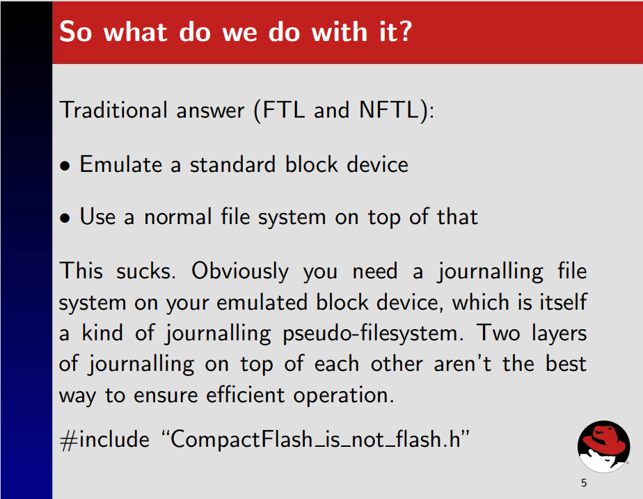
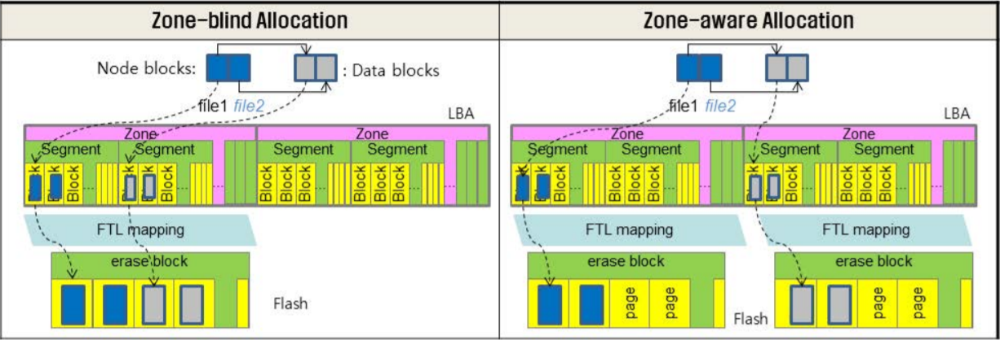
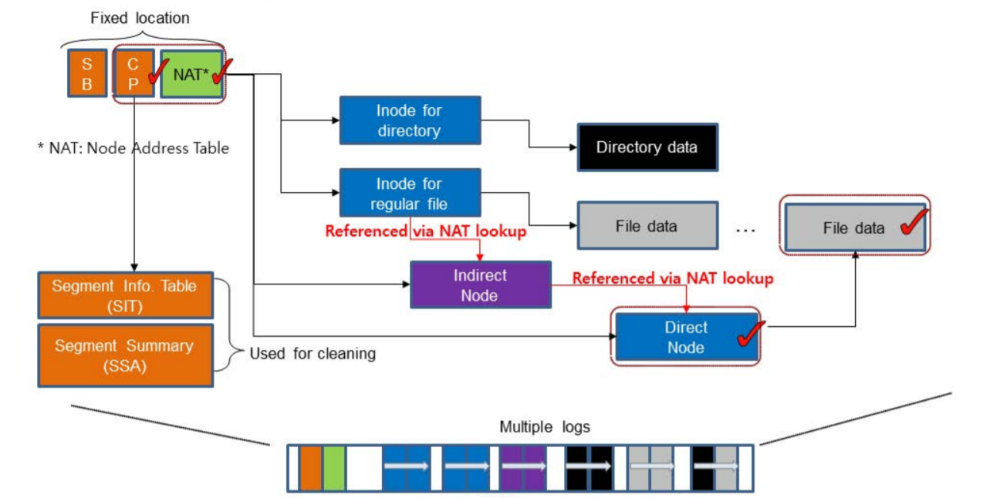
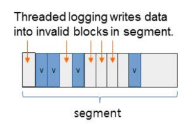
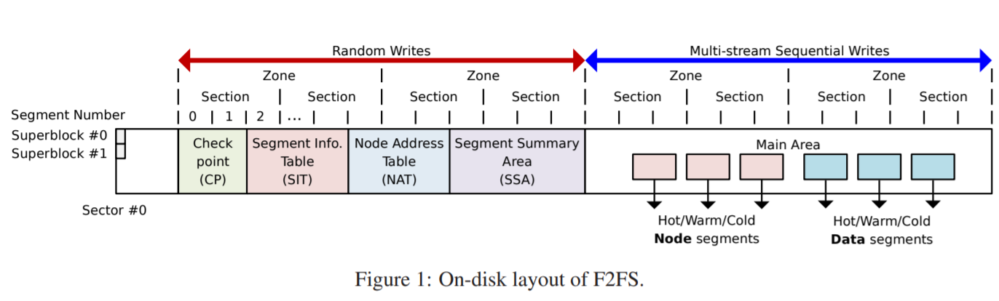

# 2021-01-26 ~ 2021-01-31 Deep Research

> 主要解决几个问题：
>
> 1. Sylix OS文件系统挂载；
> 2. Sylix IDE的智能补全机制；
> 3. JFFS（LFS）的具体操作流程；
> 4. SSD F2FS的实现方式；
>
> 参考文献：
>
> 1. [F2FS origin paper](https://www.usenix.org/system/files/conference/fast15/fast15-paper-lee.pdf)
> 2. [F2FS slides](https://www.usenix.org/sites/default/files/conference/protected-files/fast15_slides_lee.pdf)
> 3. [F2FS presentation](https://www.youtube.com/watch?v=HgCvcMQnJQ0)
> 4. [F2FS versus JFFS](https://lwn.net/Articles/519337/)
> 5. [UBIFS](http://www.linux-mtd.infradead.org/doc/ubifs_whitepaper.pdf)

[TOC]

## 蒋老师的回复

**Q：**

**问题一：**如何在SylixOS IDE中设置代码智能补全？

**问题二：**我们小组选择的Project 32是基于NorFlash的文件系统，在NandFlash越来越火的今天，为何还需要设计基于NorFlash的FS？

**A：**

**第一个问题：**置代码智能补全是IDE自带的功能，不需要设置的。

**第二个问题：**首先SylixOS上已经实现了时候NandFlash和硬盘等大型存储设备的文件系统，目前只差norflash文件系统没有实现。其次目前还有一些使用SylixOS工控及电力等设备用到了norflash，同样也有文件系统需求。另外实现一个norflash在功能上和其它设备的文件系统差不多，也就是说对于题目的学习目的来说并没有多少变化。**（工程需求、完整性需求）**

**Q：**

**针对第一个问题的回复：**我们录了一个视频，放在了附件里，确实没有看到智能补全；

**针对第二个问题的回复：**我们还想了解一下，既然本次大赛Norflash FS是要应用于工业领域，那么本项目的着力点是在norflash fs的性能上还是其可靠性上？还是两者兼具呢？

**A：**

**第一个问题：**eclipse下的智能补全和vs下的不一样，有的（如全局函数）补齐需要你按ALT+/ 键。如果是结构体，在你输入.或者->之后会自动补齐成员。

**第二个问题：**首先是要实现功能，然后肯定是必须关心可靠性，之后才是效率。我们题目要求里面有掉电安全和写平衡需求，其实也是对可靠性要求的体现。**（功能 > 可靠性 > 效率）**

工欲善其事必先利其器，没有Intellisense可太难受了。于是，写了一个简单的脚本来实现Sylix IDE类似VS的代码补全功能，这里是[工具链接](../../Tools/auto_complete.py)。使用方法很简单，打开Sylix IDE后，在代码编辑界面打开该脚本；在没有编辑代码的时候关闭此脚本即可。

## F2FS

### F2FS 轮廓
首先需要明白F2FS与JFFS之间的区别。事实上，二者**没有可比性**。因为F2FS把Flash设备看作块设备，利用FTL（Flash Translation Layer）技术；而JFFS是直接由Flash的特点设计而来。

这里有一个很有趣的问题。

在JFFS2的presentation中，作者认为利用FTL是一个**很烂**的选择。

这里值得一提的是，F2FS的诞生在2012年左右，而JFFS2在2001年左右就已经诞生。

下面是[F2FS versus JFFS](https://lwn.net/Articles/519337/)中的两条回复：

> 1. It is designed for flash devices that expose themselves as block devices (like SSDs) and not for raw flash devices as jffs2 .. so they aren't really comparable.
>
> 2. And JFFS2 works really **badly on file systems which sizes are in GBs** as it AFAIK **keeps the whole fs structure in RAM**. From scalability point of view, **UBIFS** would be more reasonable comparison.

也许在进一步深入F2FS之前还应该去阅读UBIFS。

> The big difference between JFFS2 and UBIFS is that UBIFS stores the index on flash whereas JFFS2 stores the index only in main memory, rebuilding it when the file system is mounted.

点到为止，还有更多的工作需要完成，翻译工作将在后续进行。

**从Presentation来看**，F2FS主要特点是：

1. 基于特殊FTL，该FTL能够根据规则翻译物理地址（zone 2 zone mapping）。根据后面的QA环节可以直到，这种FTL是由**三星**自研的。

   

2. 冷热数据分区。其规则是：Node比Data热，在Node中，**目录文件下的Direct Node**为Hot、**File文件下的Direct Node**为Warm、**Indirect Node**为Cold；Data中，**Dirent**为Hot、普通Data Block为Warm、**被回收的、用户指定的、多媒体数据文件**等为Cold。

3. Multi-Head Log。减少更新传播（update propagation），所有Node通过**NAT（Node Address Table）**翻译

   

4. 适应性追加Log机制（Adaptive Logging）。

   (1).Append Logging 。在垃圾清理（cleaning）的时候，**随机读顺序写**；

   (2).Threaded Logging。不需要垃圾清理，覆写dirty Segments中的不可用Block，这导致**随机写**;

   

5. Rollback机制，在Presentation中没有搞懂，还需阅读论文。

   

   

### Design and Implementation of F2FS

> 关于性能评估部分不需要做很深的研究，我们只需要知道它好就行了。不过F2FS适用于Nand Flash，但是也许我们同样可从它的设计中取出一些精华。

#### Block、Segment、Section and Zone

F2FS把整个卷分成固定大小的**Segment**，Segment是F2FS进行管理的基本单位。

其中，若干Block构成Segment；若干Segment构成Section；若干Section构成Zone；

>  在Presentation中，我们可以看到：
>
> 1. Block大小一般为4KB；
> 2. Segment大小一般为2MB，也就是512个Block；
> 3. Section大小是n个Segment；
> 4. Zone大小是m个Section；

#### 整体布局

- **SuperBlock（SB）：**SB具有F2FS文件系统的基本分区信息和一些默认参数，这些是在文件系统格式化的时候给出的，是不可更改的。

- **Checkpoint（CP）：**CP维护了文件系统的状态、有效**NAT/SIT集合的位图**、**孤儿节点（Orphan inode）**列表以及当前被激活的Segments的入口（Entries）。一个有效的**”检查点包“**应该保存**给定时间（given point of time）**的F2FS状态——用于掉电恢复。CP区域用**两个Segment**保存了两个检查点包（#0和#1）：一个用于保存最近稳定的版本，另一个用于保存一个**中间（过时的）版本**；

- **Segment Information Table（SIT）：**SIT包含了**每一个Segment的信息**，例如：Segment中有效的Block数量以及在**Main Area**中的Block的位图。另外，在垃圾清理阶段（Cleaning），SIT中的信息还被用于选择**受害Segment（Victim Segment）**并识别其中的有效块。
- **Node Address Table（NAT）：**NAT是一个Block地址映射表，用于定位所有在Main Area中的**”Node Blocks“**；
- **Segment Summary Area（SSA）：**SSA保存了**“Summary Entries”**，该**“Summary Entries”**记录了Main Area中所有**Block的归属信息**，例如：父Inode号以及它在其中的偏移**（node/data offsets）**。在垃圾清理过程中，在迁移有效块之前，这些“Entries”将被用于识别父node节点；
- **Main Area（MA）：**MA被**大小为4KB的Block填充**。每一个Block有两种大的类型：node类型或data类型。一个**“Node Block”**包含了**inode或Data Blocks索引**，而一个**“Data Block”**包含了**dirent或用户数据**。**注意，一个Section并不同时存储Node Blocks和Data Blocks**

下面举一个例子。

> 假设我们要查询文件“/dir/file”

F2FS的查找步骤如下：

1. 发现路径开始为**“/”**，则从**NAT**中寻找**Root inode**对应的地址，然后读取地址对应的**Node Block**，获得**Root inode**；
2. 在**Root inode**下，F2FS在它的**Data Block**中寻找名字为**dir**的**dirent**，通过**dirent**可以获取对应的**inode num**；
3. 接着，F2FS通过**NAT**将inode num转化为物理地址，并通过读取该物理地址对应的**Node Block**，获取名字为**dir**的**inode**；
4. 在**dir inode**中，与**步骤2**一样，找到**file**对应的**dirent**，然后获取其**inode num**，然后重复**步骤3**，最终获得**file inode**；
5. 真实的文件数据可在**Main Area**中获取，接下来要说明文件的结构。

#### 文件结构（file inode structure）

