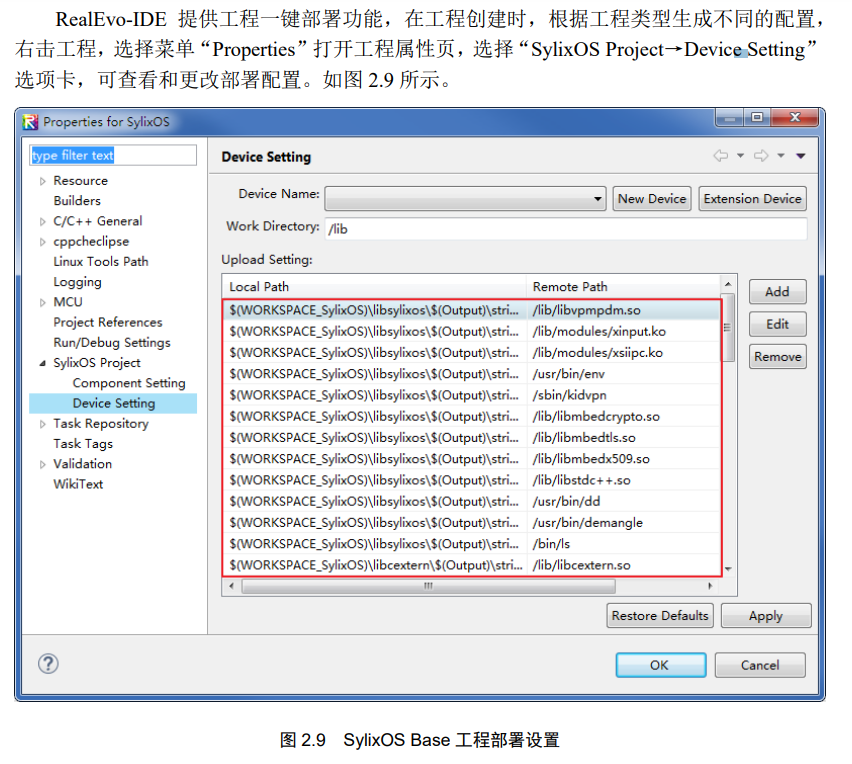
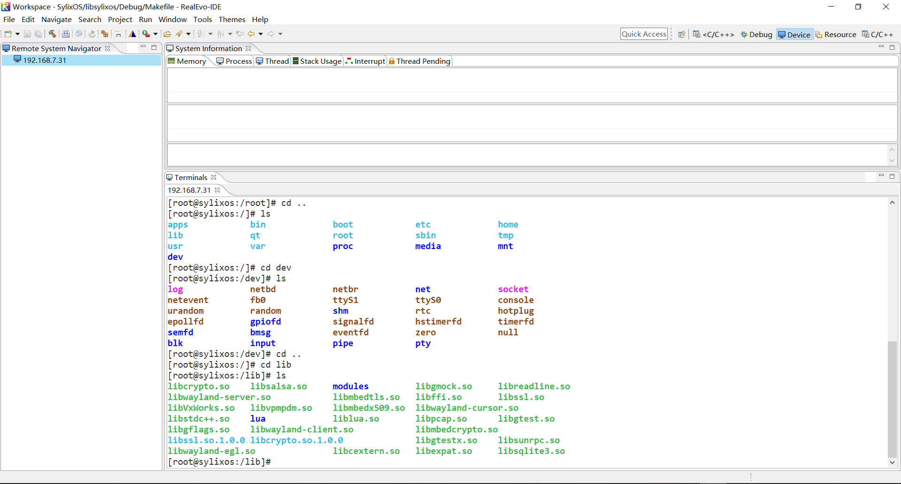
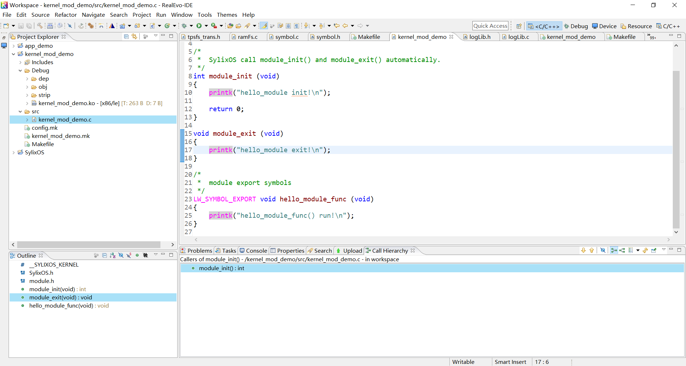
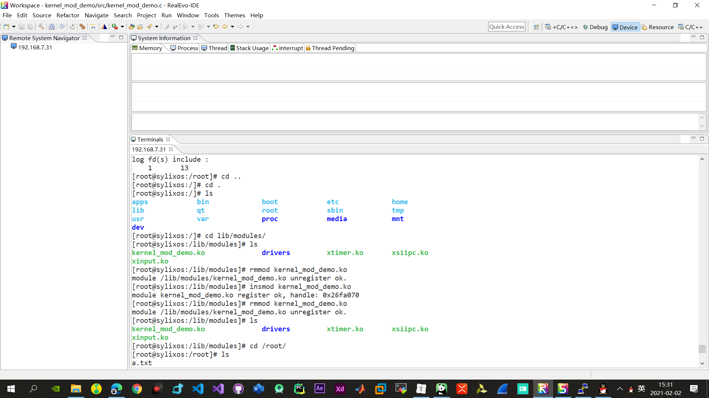
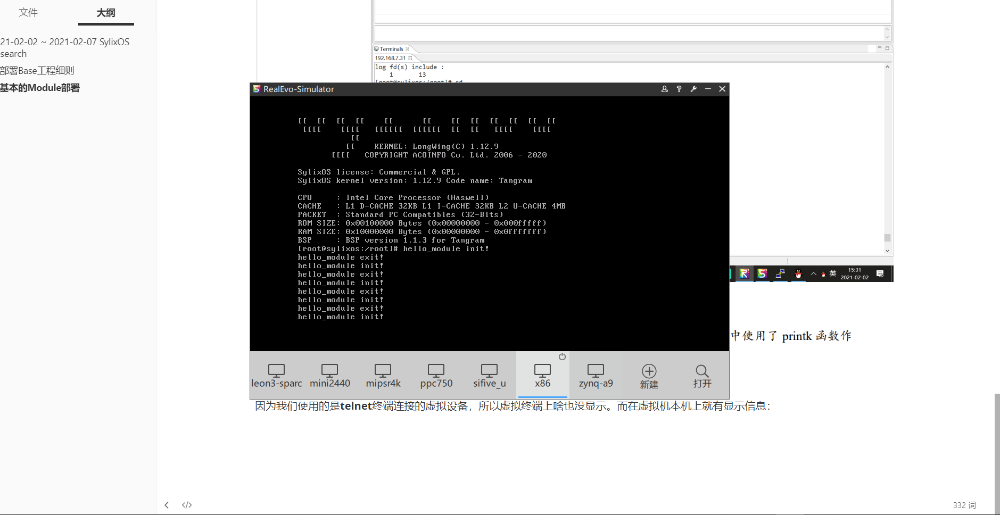
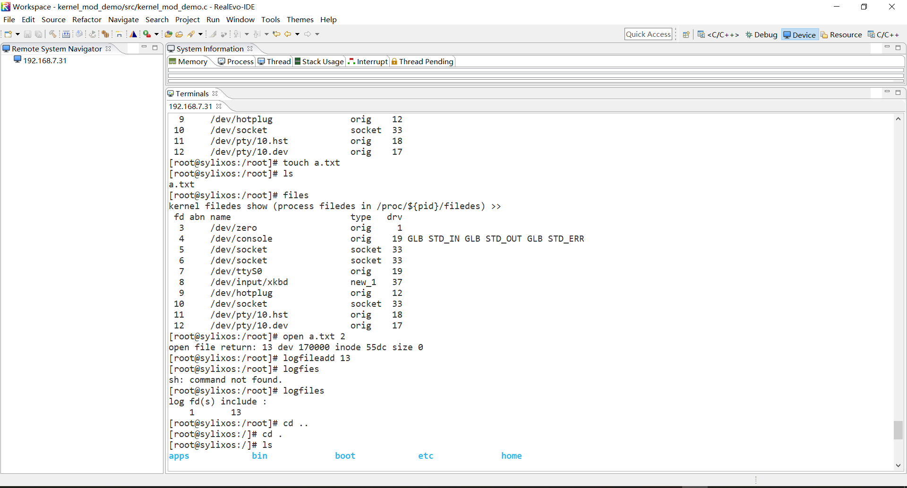
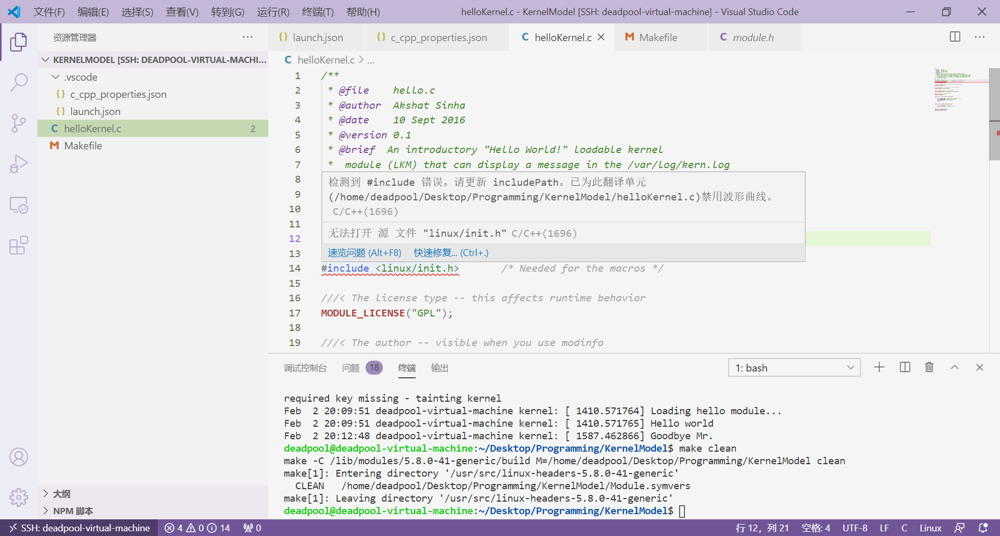
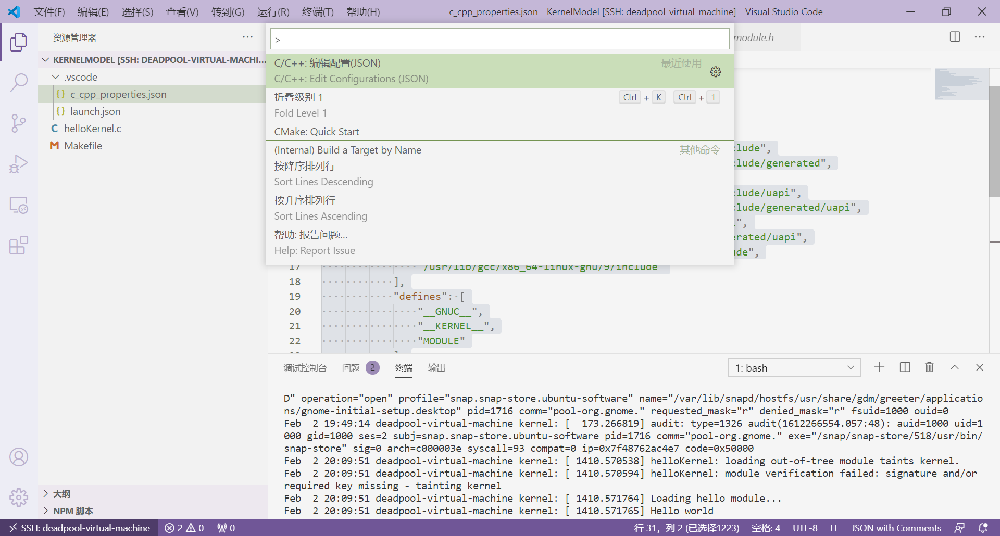
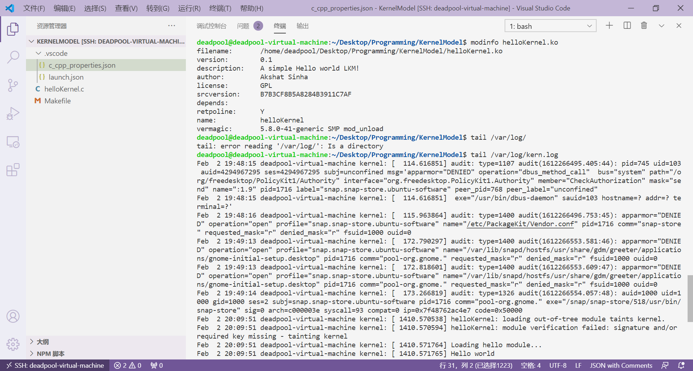

# 2021-02-02 ~ 2021-02-07 SylixOS Research

> 这周杂事比较多，时间比较紧，因此主要解决几个小问题：
>
> 1. SylixOS内核模块如何开发；
> 2. 如何mini2440开发板上运行SylixOS；
>
> 主要参考文献：
>
> 1. [SylixOS开发文档](../Files/SylixOSDoc)
> 2. [内核模块](https://blog.csdn.net/sun_junhui/article/details/47299957)
> 3. [SylixOS内核模块printk信息](http://www.voidcn.com/article/p-kdcrmbkb-bpr.html)
> 4. [Linux内核编程基本概念](https://www.geeksforgeeks.org/linux-kernel-module-programming-hello-world-program/)
> 5. [VSCode内核编程BUG](https://github.com/microsoft/vscode-cpptools/issues/5588)

## SylixOS内核编程

### 部署Base工程细则

这一节讲到一个部署，初看丈二和尚摸不着头脑……然后突然想到，这个lib好像和Linux的某个Root下的文件夹名字一样。



于是，看了一下，果然是这样，strip文件夹下的库都被部署到了远程虚拟机之上。



后面系统部署的时候，只需要我们能够链接目标设备，应该就可以运行SylixOS？

### 基本的Module部署

按照RealEvo-IDE使用手册的指示，创建第一个Module工程：



接下来，通过`insmod`或者`modulereg`指令即可在虚拟机上注册Module，用`rmmod`或者`moduleunreg`命令即可卸载Module：



这里没有看到终端给出任何提示，需要注意这个**小提示**：


因为我们使用的是**telnet**终端连接的虚拟设备，所以虚拟终端上啥也没显示。而在虚拟机本机上就有显示信息：



为了能够通过telnet观察到**printk**的**Log**信息，我们可以利用`logaddfile`添加一个logfile文件，然后通过`cat`指令查看该文件的信息就可以了：



详情可以参考[这篇文章](http://www.voidcn.com/article/p-kdcrmbkb-bpr.html)。

### Linux中的内核编程

> 我想，在进一步研究SylixOS之前，我最好先去看一看Linux中的内核编程是怎么样的，因为SylixOS在这个方向上的参考手册太少了，它更多是面向Application开发的手册。

#### 工欲善其事必先利其器

在根据[这篇文章]((https://www.geeksforgeeks.org/linux-kernel-module-programming-hello-world-program/))编写第一个内核程序的时候，**VSCode**报了一堆错误：



参考了大量问题解决方案后，修改c_cpp_properties.json如下：

> 注意，linux-headers-xxx版本号不一定是这个，另外，defines里一定要有“MODULE”，暂时还搞不清楚原理。
>
> 关于如何添加c_cpp_properties.json文件，只需按下`ctrl+shift+p`，然后搜索`Edit C`就能找到一个C/C++：Configuration，点击就行。
>
> 
>
> 好了，不报错了。

```json
{
    "configurations": [
        {
            "name": "Linux",
            "includePath": [
                "${workspaceFolder}/**",
                "/usr/include",
                "/usr/local/include",
                "/usr/src/linux-headers-5.8.0-38-generic/arch/x86/include",
                "/usr/src/linux-headers-5.8.0-38-generic/arch/x86/include/generated",
                "/usr/src/linux-headers-5.8.0-38-generic/include",
                "/usr/src/linux-headers-5.8.0-38-generic/arch/x86/include/uapi",
                "/usr/src/linux-headers-5.8.0-38-generic/arch/x86/include/generated/uapi",
                "/usr/src/linux-headers-5.8.0-38-generic/include/uapi",
                "/usr/src/linux-headers-5.8.0-38-generic/include/generated/uapi",
                "/usr/src/linux-headers-5.8.0-38-generic/ubuntu/include",
                "/usr/lib/gcc/x86_64-linux-gnu/9/include"
            ],
            "defines": [
                "__GNUC__",
                "__KERNEL__",
                "MODULE"
            ],
            "compilerPath": "/usr/bin/gcc",
            "cStandard": "gnu17",
            "cppStandard": "gnu++14",
            "intelliSenseMode": "gcc-x64"
        }
    ],
    "version": 4
}
```

运行结果如下：

