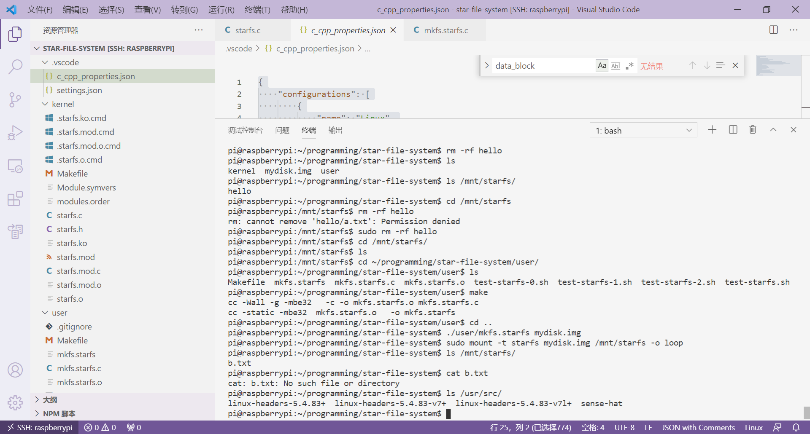
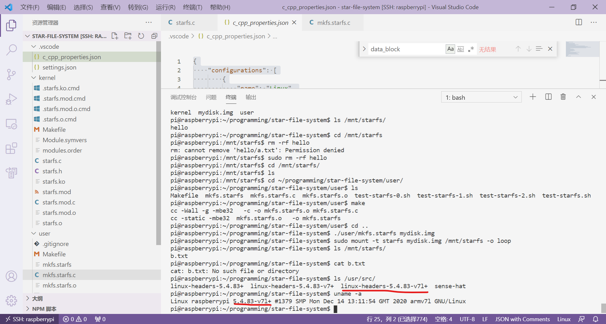
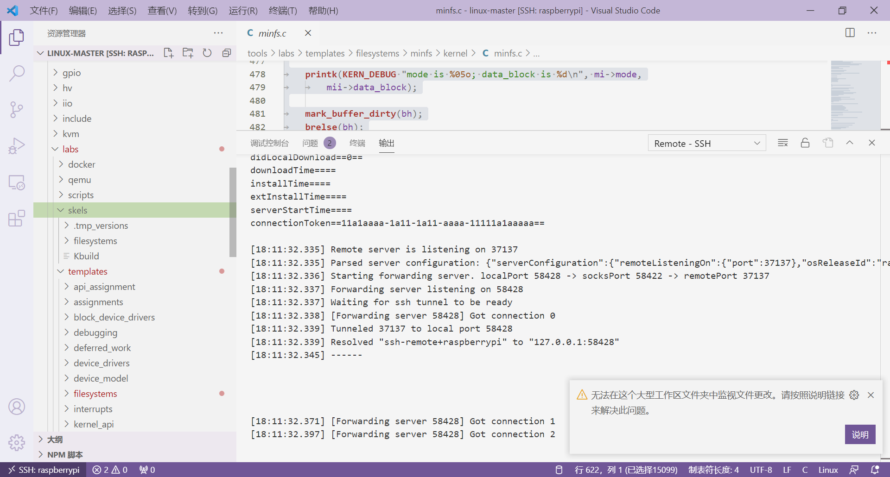
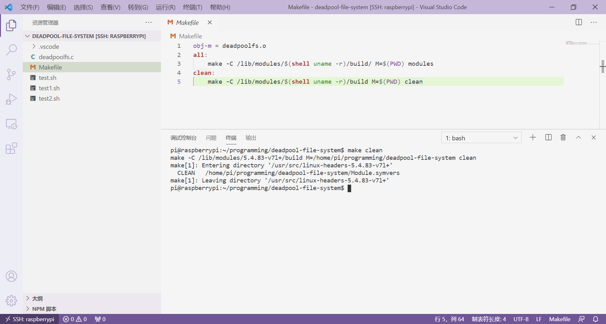
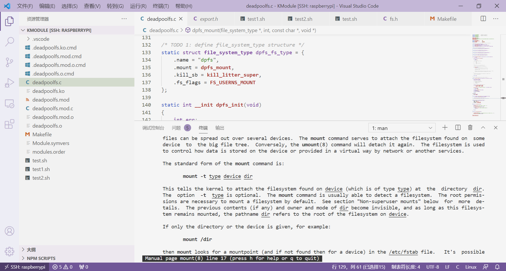
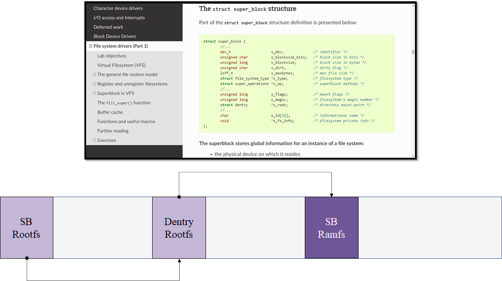
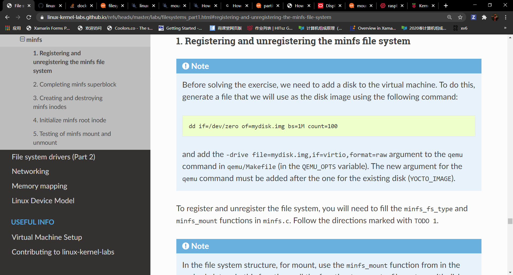

# 2021-02-02 ~ 2021-02-07 SylixOS Research

> 这周杂事比较多，时间比较紧，因此主要解决几个小问题：
>
> 1. SylixOS内核模块如何开发；
> 2. 如何mini2440开发板上运行SylixOS；
>
> 主要参考文献：
>
> 1. [SylixOS开发文档](../Files/SylixOSDoc)
> 2. [内核模块](https://blog.csdn.net/sun_junhui/article/details/47299957)
> 3. [SylixOS内核模块printk信息](http://www.voidcn.com/article/p-kdcrmbkb-bpr.html)
> 4. [Linux内核编程基本概念](https://www.geeksforgeeks.org/linux-kernel-module-programming-hello-world-program/)
> 5. [VSCode内核编程BUG](https://github.com/microsoft/vscode-cpptools/issues/5588)
> 6. [Linux内核编程之文件系统](https://linux-kernel-labs.github.io/refs/heads/master/labs/filesystems_part1.html#registering-and-unregistering-the-minfs-file-system)
> 7. [Linux下创建虚拟磁盘](../Files/Linux-create-vd.pdf)

## SylixOS内核编程

### 部署Base工程细则

这一节讲到一个部署，初看丈二和尚摸不着头脑……然后突然想到，这个lib好像和Linux的某个Root下的文件夹名字一样。


于是，看了一下，果然是这样，strip文件夹下的库都被部署到了远程虚拟机之上。


后面系统部署的时候，只需要我们能够链接目标设备，应该就可以运行SylixOS？

### 基本的Module部署

按照RealEvo-IDE使用手册的指示，创建第一个Module工程：


接下来，通过`insmod`或者`modulereg`指令即可在虚拟机上注册Module，用`rmmod`或者`moduleunreg`命令即可卸载Module：


这里没有看到终端给出任何提示，需要注意这个**小提示**：


因为我们使用的是**telnet**终端连接的虚拟设备，所以虚拟终端上啥也没显示。而在虚拟机本机上就有显示信息：


为了能够通过telnet观察到**printk**的**Log**信息，我们可以利用`logaddfile`添加一个logfile文件，然后通过`cat`指令查看该文件的信息就可以了：


详情可以参考[这篇文章](http://www.voidcn.com/article/p-kdcrmbkb-bpr.html)。

### Linux中的内核编程

> 我想，在进一步研究SylixOS之前，我最好先去看一看Linux中的内核编程是怎么样的，因为SylixOS在这个方向上的参考手册太少了，它更多是面向Application开发的手册。

#### 工欲善其事必先利其器

在根据[这篇文章]((https://www.geeksforgeeks.org/linux-kernel-module-programming-hello-world-program/))编写第一个内核程序的时候，**VSCode**报了一堆错误：


参考了大量问题解决方案后，修改c_cpp_properties.json如下：

> 注意，linux-headers-xxx版本号不一定是这个，另外，defines里一定要有“MODULE”，暂时还搞不清楚原理。
>
> 关于如何添加c_cpp_properties.json文件，只需按下`ctrl+shift+p`，然后搜索`Edit C`就能找到一个C/C++：Configuration，点击就行。
>
> 
>
> 好了，不报错了。

```json
{
    "configurations": [
        {
            "name": "Linux",
            "includePath": [
                "${workspaceFolder}/**",
                "/usr/include",
                "/usr/local/include",
                "/usr/src/linux-headers-5.8.0-38-generic/arch/x86/include",
                "/usr/src/linux-headers-5.8.0-38-generic/arch/x86/include/generated",
                "/usr/src/linux-headers-5.8.0-38-generic/include",
                "/usr/src/linux-headers-5.8.0-38-generic/arch/x86/include/uapi",
                "/usr/src/linux-headers-5.8.0-38-generic/arch/x86/include/generated/uapi",
                "/usr/src/linux-headers-5.8.0-38-generic/include/uapi",
                "/usr/src/linux-headers-5.8.0-38-generic/include/generated/uapi",
                "/usr/src/linux-headers-5.8.0-38-generic/ubuntu/include",
                "/usr/lib/gcc/x86_64-linux-gnu/9/include"
            ],
            "defines": [
                "__GNUC__",
                "__KERNEL__",
                "MODULE"
            ],
            "compilerPath": "/usr/bin/gcc",
            "cStandard": "gnu17",
            "cppStandard": "gnu++14",
            "intelliSenseMode": "gcc-x64"
        }
    ],
    "version": 4
}
```

运行结果如下：


#### Linux-Kernel-Labs

> 这是Github上一个Star数7伯多的项目。文档+实验，带你初窥Linux内核架构。由于项目需要，这里我专门选择文件系统部分实验进行。当然，它这个实验是运行在qemu上的，与我们的情况稍有不同（我是跑在树莓派上的）。另外，需要强调一下，在树莓派中开发内核时，VSCode的配置，我会在后面一一介绍。

##### 用VSCode进行树莓派内核开发配置

```json
{
    "configurations": [
        {
            "name": "Linux",
            "includePath": [
                "${workspaceFolder}/**",
                "/usr/include",
                "/usr/src/linux-headers-5.4.83-v7+/include",
                "/usr/src/linux-headers-5.4.83-v7+/arch/arm/include",
                "/usr/src/linux-headers-5.4.83-v7+/arch/arm/include/generated",
                "/usr/src/linux-headers-5.4.83-v7+/include/uapi"
            ],
            "defines": [
                "__GNUC__",
                "__KERNEL__",
                "MODULE"
            ],
            "compilerPath": "/usr/bin/gcc",
            "cStandard": "gnu17",
            "cppStandard": "gnu++14",
            "intelliSenseMode": "gcc-arm"
        }
    ],
    "version": 4
}
```

这里很有可能没有`linux-headers-*`，参考官方手册，在命令行内运行如下代码：

```bash
sudo apt install raspberrypi-kernel-headers
ls usr/src
```

我的运行结果如下：



注意，还需要运行一下：

```bash
uname -a
```

来验证版本是否一致，例如：



这里如果版本不匹配怎么办呢？事实上，如果我们运行过

```bash
sudo rpi-update
```

那么，树莓派内核版本会高出`linux-headers-*`几个版本，很神奇，解决方案是参考[这篇论坛](https://raspberrypi.stackexchange.com/questions/101790/how-to-revert-from-rpi-update-to-stable-build)。运行如下代码：

```bash
sudo apt-get update
sudo apt-get install --reinstall raspberrypi-bootloader raspberrypi-kernel
```

OK，现在我们就完成了树莓派内核开发的配置了，🛫。

##### 实验准备

按照**Lab**的介绍，需要首先根据**Templates**生成代码框架，然后进行填填补补，主要步骤如下：

```bash
# 克隆项目
git clone https://github.com/linux-kernel-labs/linux
cd linux-kernel-labs/linux/tools/labs
# 生成框架
LABS=filesystems make skels
```

接下来，找到这里：



好了，可以去`filesystems`文件夹下copy任务代码了。

##### deadpoolfs

> 实际上就是修改了myfs的名称

建一个文件夹，长下面这个样子：



注意，我们只需要实验的代码，因此修改一下Makefile为我们在Tutorial中学到的熟悉的形式。

然后跟着[**Lab**](https://linux-kernel-labs.github.io/refs/heads/master/labs/filesystems_part1.html#register-and-unregister-the-myfs-file-system)写代码，很简单。这里主要再强化一下mount操作，以加深对它的理解。

挂载deadpool文件系统的代码如下：

```bash
# 加载deadpoolfs模块
sudo insmod deadpoolfs.ko

# 创建挂载点（就是一个目录了）
sudo mkdir -p /mnt/dpfs

# 挂载dpfs到挂载点上
sudo mount -t dpfs none /mnt/dpfs
```

> The `none` argument sent to the `mount` command indicates that we do not have a device from which to mount, the file system being a virtual one. Similarly, this is how the `procfs` or `sysfs` filesystems are mounted on Linux systems.
>
> 
>
> 可以用`man mount`命令查看mount的用法，`-t`指明挂载设备选用什么文件系统，`dev`指明要挂载的设备，这里是`none`，说明是虚拟设备，`dir`，即挂载点，通过这个挂载点可以访问设备中的文件。提到**挂载点**，这里可以看一下Linux里对挂载点的定义：
>
> 
>
> 实际上，上面这张图生动地说明了什么叫**挂载文件系统**。

剩下的工作跟随Lab走就行。下面，得着重说明一下**minfs**实验，也就是后面的**starfs**。

##### starfs

> 实际上就是修改了minfs的名称

实验环境的配置一直是老大难的问题，最主要的问题发生在这里：



这个实验是要求我们自己体验挂载一个文件系统到块设备，即`none`变为某个设备名称。

`-drive file=mydisk.img,if=virtio,format=raw`，大概就是说为**qemu**添加一个**虚拟磁盘**。可惜，我们并没有用到qemu，那么怎么添加一个块设备呢？

这里就了解到Linux中的`/dev/loop`为循环设备，是虚拟块设备。接下来，我们可以通过如下命令来完成文件系统的挂载，参考自[Linux下创建虚拟磁盘](../Files/Linux-create-vd.pdf)（假如说我们完成了**starfs**实验）。

```bash
# 到实验根目录
cd star-file-system
# 到kernel目录
cd star-file-system/kernel
# 编译内核
make
cd ..
# 创建mydisk.img文件
dd if=/dev/zero of=mydisk.img bs=1M count=100
# 到user文件
cd star-file-system/user
make # 报错就把 -m32都改成-mbe32
# 回到实验根目录
cd ..
# 格式化mydisk.img为starfs文件系统
./user/mkfs.starfs mydisk.img
# 挂载
# 这里-o是将mydisk.img映射到dev/loop0虚拟块设备之上
sudo mount -t starfs mydisk.img /mnt/starfs -o loop
# 检验是否挂载成功
ls /mnt/starfs/
# 有一个a.txt文件，则说明挂载成功了
> a.txt
```

接下来就可以正常完成实验了。

> 这几天折腾了mini2440半天，又折腾了Lab半天，今天终于解决了Lab问题。mini2440的转接头可能有问题，还需继续研究——心态有点蹦蹦炸。


