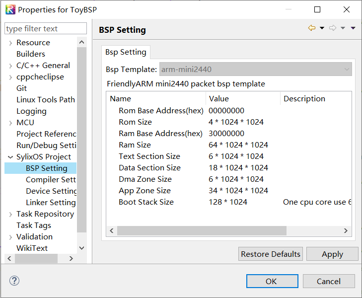
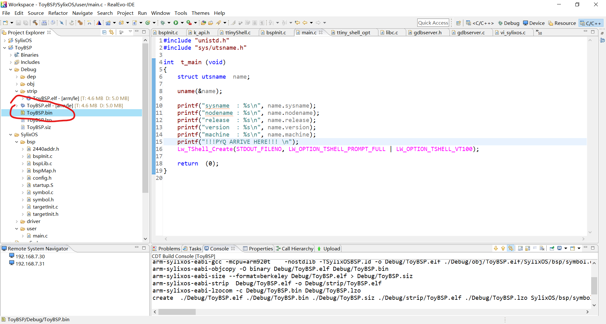
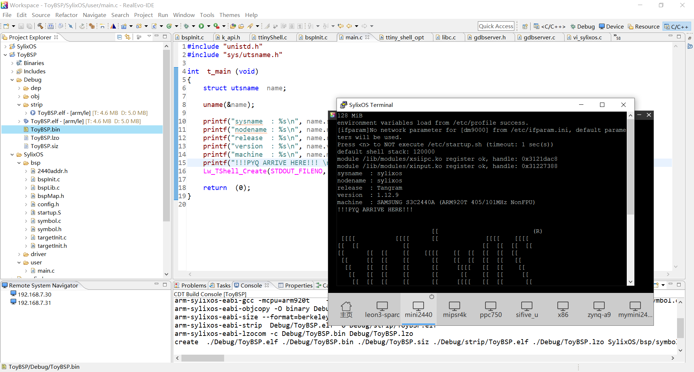
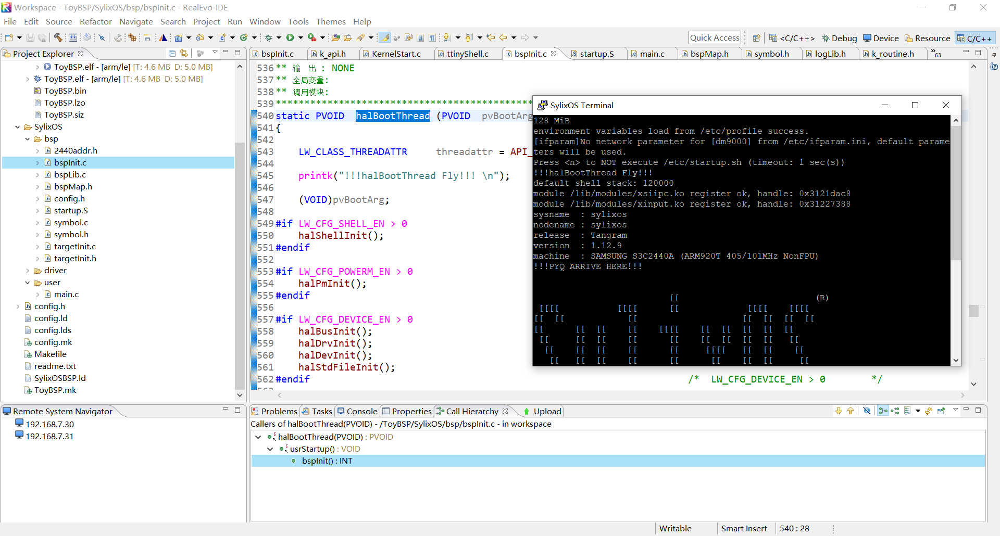
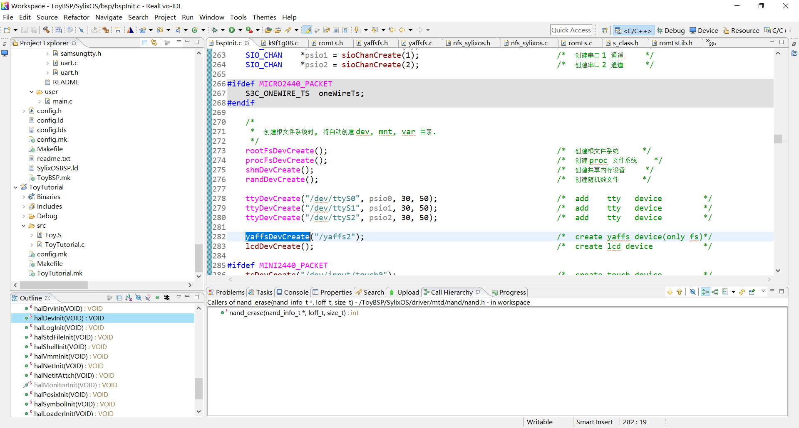
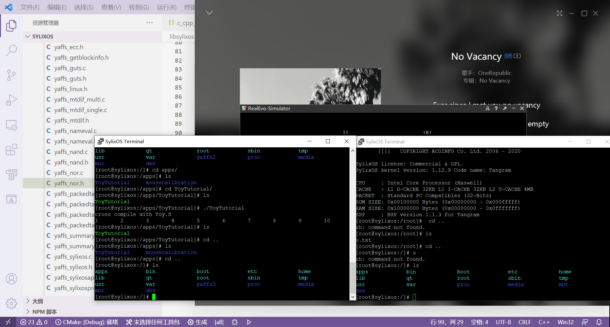
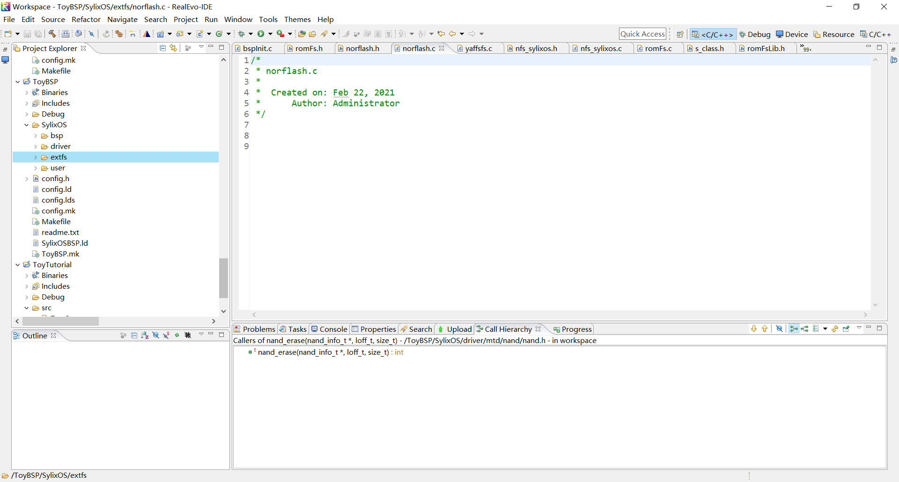
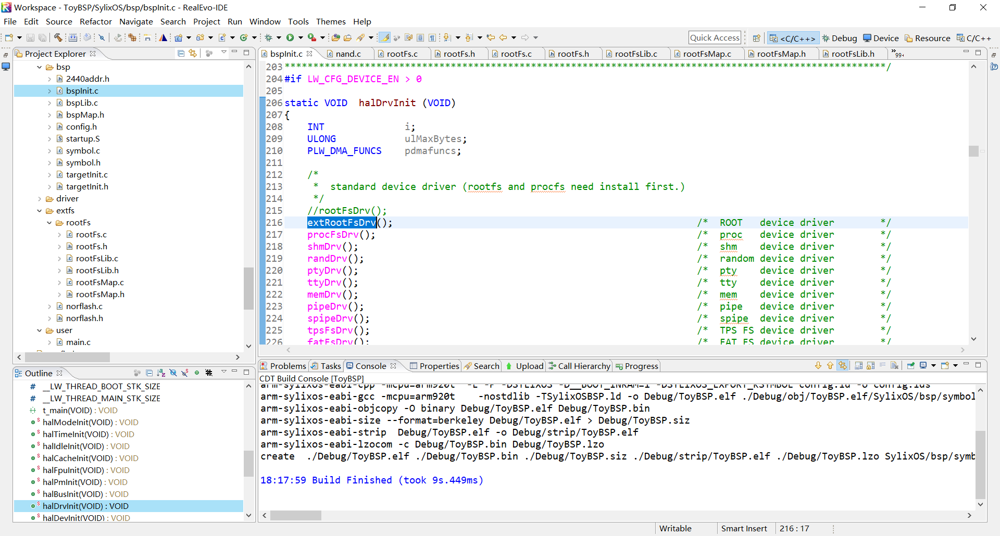

# 2021-02-15 ~ 2021-02-21 SylixOS Research

> 本阶段的工作是继续对SylixOS的研究。由于春节假期等因素所致，目前并不能得到有效的资源，很多工作无法迅速展开。例如上一阶段的内核模块编程或者是开发板的研究。目前采用策略是尽可能搞懂SylixOS的BSP启动流程，然后研究我们加入自己代码的方法。
>
> 参考资料：
>
> 1. [韩辉的博客？？？](https://blog.51cto.com/hanhui03/1663598)
>
> 简单的总结PPT：
>
> [第四阶段-SylixOS进阶研究(2021-02-23)](../Files/PPT/sylixos-further-research-stage.pptx)

## 初窥BSP

### SylixOS整体运行逻辑

根据韩慧的博客以及BSP工程项目结构，可以总结SylixOS的**宏观**启动流程如下：


同时结合上周Yaffs2装载记录，现在便可以有一个整体把握：

```mermaid
graph TB
	A[halBootThread]-->B[halDrvInit]
	A -->C[halDevInit]
	B -->D[API_YaffsDrvInstall]
	C -->E[API_YaffsDevCreate]
	E -->F[API_IosDevAddEx]
```


### 创建BSP工程

根据[《RealEvo-IDE使用手册》](../Files/SylixOSDoc/RealEvo-IDE使用手册.pdf)，可以轻松完成BSP工程的创建。

这里注意我们应该选择arm-sylixos-toolchain，相应的BSP工程选择arm-mini2440



### 部署BSP工程

Build BSP Project后，在Debug文件夹下能够找到`.elf`和`.bin`文件。对于mini2440，选择`.bin`文件进行烧录。



用虚拟机模拟烧录，即将内核文件更改为`ToyBSP.bin`即可


接下来，运行结果如下：



## 探索BSP

### 调试BSP文件

`printf`函数位于`unistd.h`中，SylixOS的BSP工程将**内核任务程序**（`user/main.c`）与**内核基本程序**（`bsp`）分离开，在`main.c`中，能够使用`printf`，而在`bsp`不能使用`printf`，这时，应该使用`printk`来进行输出调试。



### Nand驱动安装


这样不太方便观察，我们绘制一下调用图：


- **nand_init：**用于调用nand_init_chip；
- **nand_init_chip：**设置IO读写地址，调用`board_nand_init`，`nand_scan`与`nand_register`；
- **board_nand_init：**进行开发板硬件初始化，这里是mini2440（s3c24xx）；
- **nand_scan：**这一部分在[03-DeepResearch-Part2.md](./03-DeepResearch-Part2.md)中有所介绍，主要**“根据mtd->priv即nand_chip中的成员初始化mtd_info”**；
- **nand_register：**目前看来是给添加的nand设备改个名，计算`total_nand_size`，然后更新`nand_curr_device` ;

---

```c
int board_nand_init (struct nand_chip *nand)
{
    rGPACON = (rGPACON & ~(0x3f << 17)) | (0x3f << 17); /* GPIO config */

#define NAND_TACLS                  2        /*  CLE & ALE (Min:10ns) */
                                             /*  CLE Hold Time tCLH */
#define NAND_TWRPH0                 4        /*  nWE (Min:25ns) */
                                             /*  nWE Pulse Width tWP */
#define NAND_TWRPH1                 2        /*  nWE (Min:15ns) */
                                             /*  nWE High Hold Time tWH */
    rNFCONF = (NAND_TACLS << 12)             /*  HCLK x (TACLS) */
            | (NAND_TWRPH0 << 8)             /*  HCLK x (TWRPH0 + 1) */
            | (NAND_TWRPH1 << 4);            /*  HCLK x (TWRPH1 + 1) */

    rNFCONT = (0 << 13)                      /*  Disable lock-tight */
            | (0 << 12)                      /*  Disable Soft lock */
            | (0 << 10)                      /*  Disable interrupt */
            | (0 <<  9)                      /*  Disable RnB interrupt */
            | (0 <<  8)                      /*  RnB Detect rising edge */
            | (1 <<  6)                      /*  Lock spare ECC */
            | (1 <<  5)                      /*  Lock main data area ECC */
            | (1 <<  4)                      /*  Initialize ECC de/encoder */
            | (1 <<  1)                      /*  Force nFCE to high */
                                             /*  (Disable chip select)*/
            | (1 <<  0);                     /*  NAND flash controller enable*/

    rNFSTAT = 0;

    /*
     * initialize nand_chip data structure
     */
    nand->IO_ADDR_R = nand->IO_ADDR_W = (void *)NFDATA;

    nand->ecc.mode  = NAND_ECC_SOFT;

    /*
     *  read_buf and write_buf are default
     *  read_byte and write_byte are default
     *  but cmd_ctrl and dev_ready always must be implemented
     */
    nand->cmd_ctrl  = s3c24xx_hwcontrol;
    nand->dev_ready = s3c24xx_dev_ready;

    return 0;
}
```


### 从BSP看如何修改Kernel代码


这里需要注意的是，`printf`一定要放在`halShellInit`和`halLogInit`之后，不然看不到输出。因此我们可以用`printk`去观察在调用这两个函数之前做的事情。另外，修改内核函数后一定要记得编译一次**SylixOS**，然后再编译**BSP**，这样就可以完成内核的更新。**不过编译一次内核（就加了一个printk）要2min，太慢了，个人认为应该在BSP文件中添加额外的NorFS驱动文件以加快开发速度**。


## 蒋老师的回复

> 时隔10几天，他终于在陈宏邦老师的催促下有了回复

### 开发建议

**Q：**现在对如何在SylixOS上开发文件系统还有一定的疑惑。我们应该采用内核模块开发？还是应该直接在源码上开发呢？另外，我发现诸如FSSUP类是采用的硬编码方式，如果我们新加一个文件系统，那是否无可避免地涉及到修改源码呢？另外，老师，您还有更多的关于SylixOS内核模块开发手册或者教程吗，现在官方给出的Doc文档只有一个简单的Hello内核模块，没办法起到一个很好地参考作用。

**A：**

1、目前我们所有文件系统都是直接在源码中添加的，建议直接在源码上开发，这样方便调试和功能实现。等功能开发和调试完毕再考虑编译成ko。

2、ide中有内核模块开发的文档：“help->Open SylixOS Driver user Manual”，此外如果文档中的说明信息不是很全的话，可以参考sylixos中其它文件系统的实现如tpsfs、ramfs。


好了，目前的开发路线基本敲定了。采用BSP + Kernel的方式进行开发。我们需要在BSP工程中完成对NorFlash文件系统驱动的装载，就像mini2440 BSP模板给的一样：



运行结果如下（左为mini2440虚拟机，右为x86虚拟机）：



另外，也许蒋老师说得并不是完全正确，我们同样可以在BSP项目中完成文件系统的开发——新建一个文件夹即可：



但是这样可能会打破项目基本结构，但毫无疑问可以加快编译时间以加速开发。因此，我们首先在BSP工程的`extfs`中开发，接下来将其移植至Kernel中。如下所示，实验证明，这种方式是可行的，SylixOS能够正常运行。



另外，RealEvo-IDE的开发还是太难受了，可以尝试使用VSCode进行开发，`ctrl+shift+p`打开C/C++ Configuration，修改如下：

``` json
{
    "configurations": [
        {
            "name": "Win32",
            "includePath": [
                "xxx\\SylixOS-IDE\\RealEvo\\compiler\\arm-sylixos-toolchain\\arm-sylixos-eabi\\include",
                "xxx\\SylixOS-IDE\\RealEvo\\compiler\\arm-sylixos-toolchain\\lib\\gcc\\arm-sylixos-eabi\\4.9.3\\include",
                "xxx\\Workspace\\SylixOS\\libcextern\\libcextern\\include",
                "xxx\\Workspace\\SylixOS\\libsylixos\\SylixOS",
                "xxx\\Workspace\\SylixOS\\libsylixos\\SylixOS\\include",
                "xxx\\Workspace\\SylixOS\\libsylixos\\SylixOS\\include\\network"
            ],
            "defines": [
                "_DEBUG",
                "UNICODE",
                "_UNICODE"
            ],
            "cStandard": "c89",
            "intelliSenseMode": "gcc-x64"
        }
    ],
    "version": 4
}
```

### NorFlash驱动

**Q：**我在bspmini2440源码中没有看到norflash驱动文件，请问我们需要自行实现nor驱动吗？如果是的话，那有没有什么参考资料呢?

**A：**你好，我们的bspmini2440源码中确实没有norflash驱动实现，我刚刚在网上搜了一下，2440的norflash操作时序并不复杂，你可以参考网上的裸机代码简单实现（注意不要去参考linux实现，会比较复杂）。

https://www.xuebuyuan.com/1552484.html

https://blog.csdn.net/m0_37633745/article/details/103188617

https://blog.csdn.net/Mculover666/article/details/104115535

## NorFlash驱动尝试

### 驱动初始化

**x86 hda设备初始化**


**mini2440 nand初始化**


