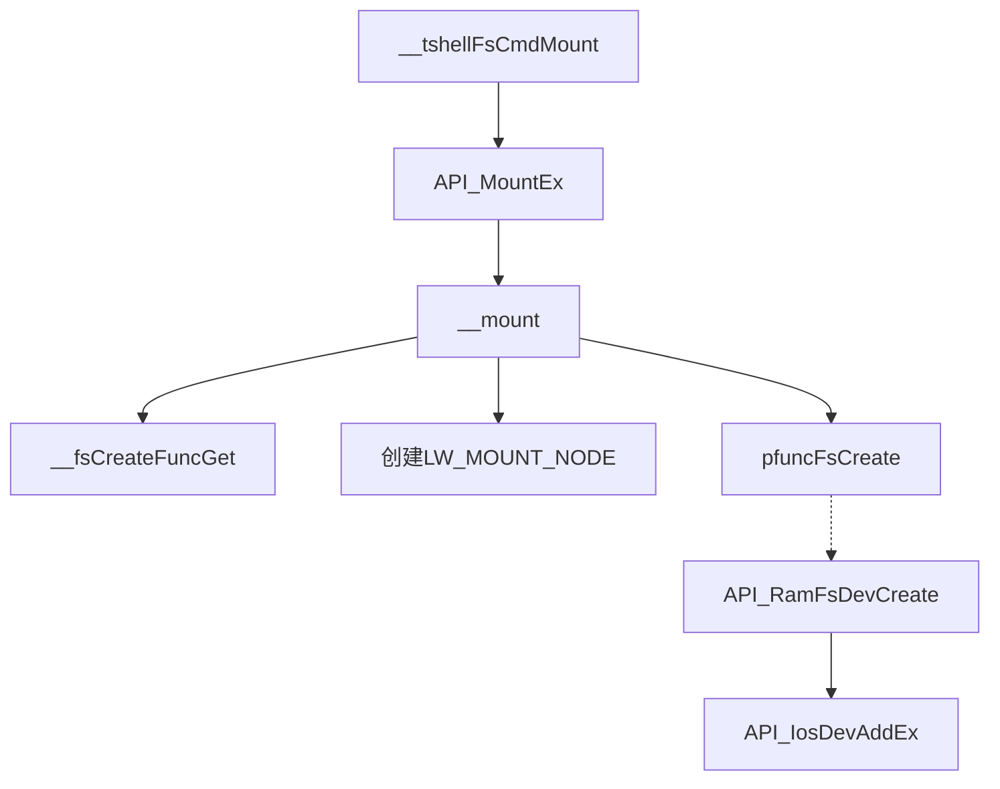

# simpleFs试验

>mount -t simplefs 1000 /mnt/simple
>
>

## 一些疑惑


## mount指令

函数：__tshellFsCmdMount

位置：ttinyShellFsCmd

#### 重要结构体

>LW_MOUNT_NODE 
>
>​	-> LW_BLK_RAW
>
>​		 -> LW_BLK_DEV
>
>RAM_VOLUME 
>
>​	-> LW_DEV_HDR

#### 流程



#### 各函数的作用

> __tshellFsCmdMount：
>
> ​	处理mount命令中的参数。
>
> __mount：
>
> ​	创建PLW_MOUNT_NODE。
>
> ​	保存卷挂载名（即/mnt/simple）到PLW_MOUNT_NODE。
>
> ​	保存设备名（即10000）到PLW_MOUNT_NODE。
>
> ​	调用API_RamFsDevCreate。
>
> ​	将PLW_MOUNT_NODE挂到链表_G_plineMountDevHeader上。
>
> API_IosDevAddEx：
>
> ​	创建PLW_DEV_HDR。
>
> ​	填写PLW_DEV_HDR相关信息。
>
> ​	创建根目录节点（rootFsMakeDev）。
>
> ​	将PLW_DEV_HDR挂载到链表_S_plineDevHdrHeader上。


```c
/*********************************************************************************************************
** 函数名称: API_MountEx
** 功能描述: 挂载一个分区
** 输　入  : pcDevName         块设备名   例如: /dev/sda1 [mount RAMFS文件系统时，传入的不是设备文件名而是RAMFS占用的最大内存空间，这个参数必须是10进行，单位是字节]
**           pcVolName         挂载目标   例如: /mnt/usb (不能使用相对路径, 否则无法卸载)
**           pcFileSystem      文件系统格式 "vfat" "iso9660" "ntfs" "nfs" "romfs" "ramfs" ... 
                               NULL 表示使用默认文件系统
**           pcOption          选项, 当前支持 ro 或者 rw
** 输　出  : < 0 表示失败
** 全局变量: 
** 调用模块: 
                                           API 函数
*********************************************************************************************************/
LW_API 
INT  API_MountEx (CPCHAR  pcDevName, CPCHAR  pcVolName, CPCHAR  pcFileSystem, CPCHAR  pcOption)
{
    INT     iRet;
    
    __KERNEL_SPACE_ENTER();
    iRet = __mount(pcDevName, pcVolName, pcFileSystem, pcOption);
    __KERNEL_SPACE_EXIT();
    
    return  (iRet);
}
```

### mkdir指令

函数：__tshellFsCmdMkdir

位置：ttinyShellFsCmd

>**_IosEnvGetDef：**获取环境变量结构体，以便获得文件权限标志（IOE_modeUMask）。
>
>**ioFullFileNameGet：**获取完整路径和该路径对应的设备。
>
>**iosFdNew：**由系统创建一个新的文件描述符并在对应LW_FD_ENTRY中记录设备头等信息。
>
>**iosCreate（API_IosCreate）：**从驱动程序表（_S_deventryTbl）获取文件创建函数pfuncDrvCreate，然后调用该函数。ramfs的驱动设备在API_RamFsDrvInstall中的iosDrvInstallEx2函数里就在驱动程序表上注册了这个函数。
>
>

函数：__ramFsOpen

位置：ramFs.c

> __RAMFS_VOL_LOCK：为ramfs上锁。
>
> __ram_open：ramfs把"/mnt/simple/"作为了根目录，所以"/mnt/simple/"对应参数pcname为"/"。这个函数用于返回ramfs下的一个文件节点。ramfs里文件inode以链表的方式存储。
>
> __ram_maken：如果上边\_\_ram_open没有找到节点（mkdir就是这个情况），则在这里创建一个新的节点，记录文件名称，类型等信息。
>
> __ram_stat：初始化该文件的stat。
>
> API_IosFdNodeAdd：遍历（文件系统已打开的文件）pramfs->RAMFS_plineFdNodeHeader。
>
> 

## ramFs修改成simpleFs的过程

> mount -t ramfs 10000 /mnt/ram
>
> mount -t simplefs 10001 /mnt/simple

1. 更改了加载驱动、创建设备和删除设备(simpleFs.c)三个函数的名字以及相应的宏定义(simpleFs.h)。

2. 更改了simpleFs.c和simpleFsLib.c里的include。

3. 将simpleFs头文件添加到文件系统头文件(fs_fs.h)中。

4. 修改API_SemaphoreMCreate参数，把锁的名称改为simplevol_lock。

5. 把DRIVER_DESCRIPTION和__fsRegister参数中的"ram"改成"simple"。

6. 修改了simpleFs.h中的裁剪宏__SIMPLEFS_H。

   > 裁剪宏（ifndef）：如果某个宏定义没有被定义过，则会编译"#ifndef"到"#endif"之间的程序。

7. 在__tshellFsCmdMount中打印mount信息。

8. 在__mount中，ramfs不需要操作 BLK RAM设备（bNeeddelete为0）。所以添加一个判断，让simpleFs也不需要。