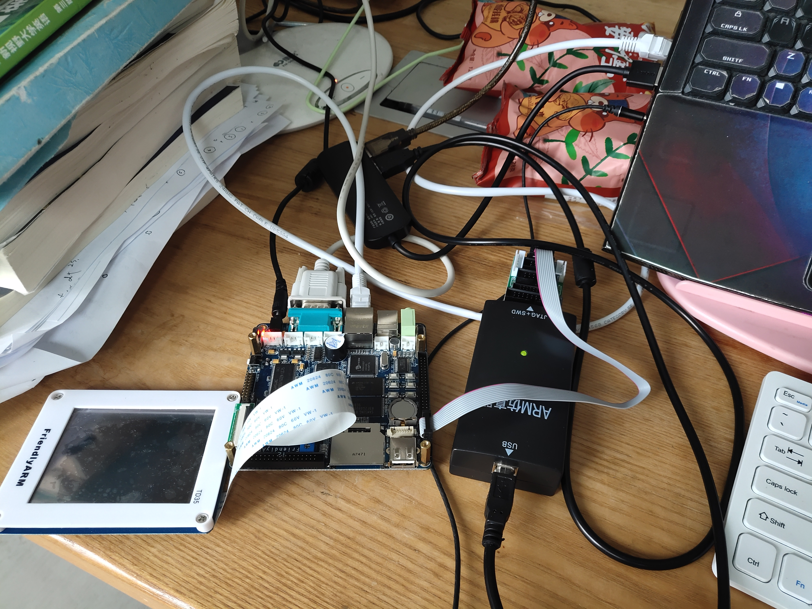
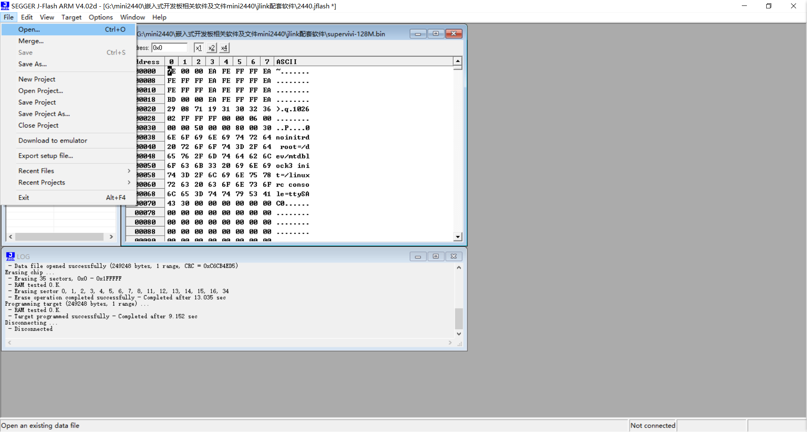
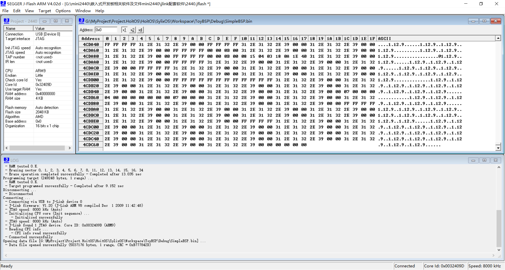
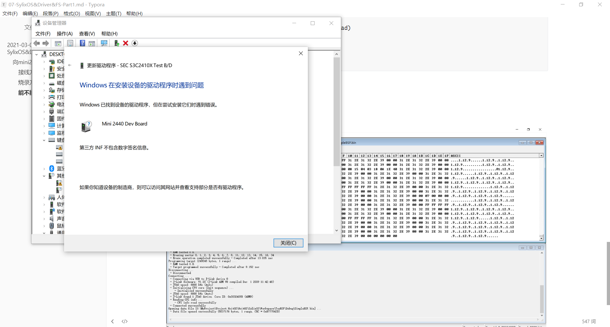
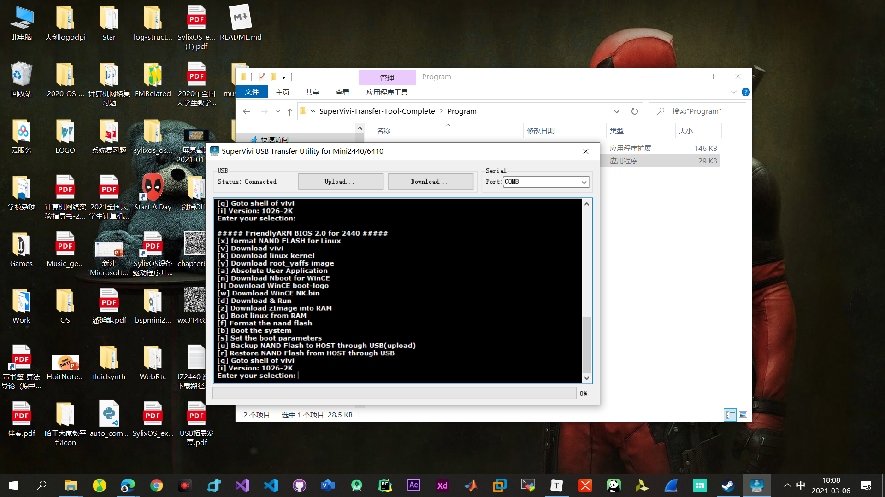
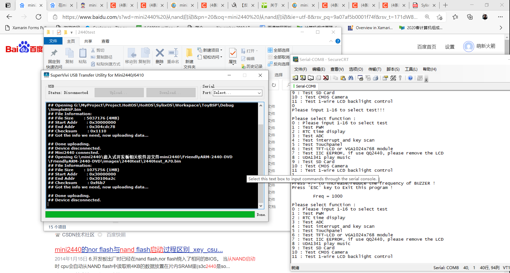
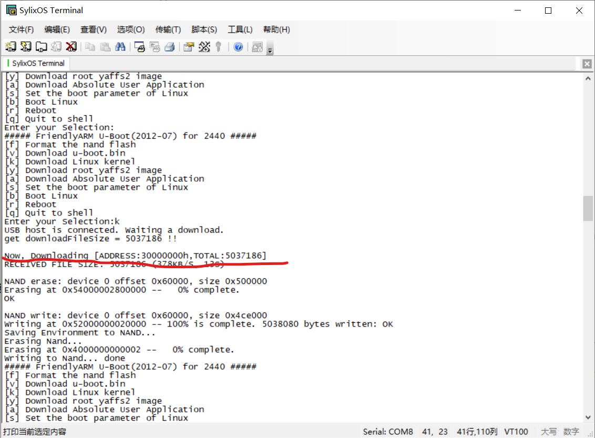

# 2021-03-02 ~ 2021-03-08 SylixOS&Driver&FS

> 本周由于挑战杯事情耽搁了，不一定能够按时完成。
>
> 1. 主要研究如何访问mini2440上的Norflash；
> 2. 如何mini2440烧录SylixOSBSP；
> 3. 设计一个文件系统；
>
> 参考文献：
>
> 1. [烧录SupperVivi至mini2440 NorFlash](https://baijiahao.baidu.com/s?id=1625278505123393830&wfr=spider&for=pc)
> 2. [JZ2440学习资料](https://pan.baidu.com/play/video#/video?path=%2F%E5%B5%8C%E5%85%A5%E5%BC%8F%E5%BC%80%E5%8F%91%2FJZ2440%2F%E5%AD%A6%E5%89%8D%E7%8F%AD%2F%E7%AC%AC0%E8%AF%BE%E7%AC%AC1%E8%8A%82_%E5%88%9A%E6%8E%A5%E8%A7%A6%E5%BC%80%E5%8F%91%E6%9D%BF%E4%B9%8B%E6%8E%A5%E5%8F%A3%E6%8E%A5%E7%BA%BF%E5%B7%A5%E5%85%B7.WMV&t=-1)
> 3. [驱动安装失败](http://www.360doc.com/content/20/0807/21/34398161_929084807.shtml)
>
> 本周小总结：
>
> [第六阶段-研究SylixOS、Driver以及文件系统 待续……(2021-03-09)](../Files/PPT/sylixos-driver-fs-stage1.pptx)

## 向mini2440中烧写SupperVivi

> **需要软件：**
>
> https://pan.baidu.com/s/1kcAXxhNDh2mrfFuB9dJwxA 
>
> 提取码：UdWy 
>
> **硬件需要**：
>
> Jlink V8仿真器；mini2440开发板；串口线

### 接线方式



### 烧录方式

1. 接好线；

2. 调整开发板从**NorFlash启动**，此时显示器应该是白花花一片；

3. 在软件包里找到`Jlink配套软件`，安装`Setup_JLinkARM_V402d.exe`；（已整合至`Tools`工具包）

4. 运行`JFlash-Arm`；

5. 点击File之后点击open，选择`jlink配套软件`下的`.jflash`文件；

   

6. 点击`Target`，`Connect`；

7. 在Log面板将显示Connect Successfully；

8. 点击`File`，`Open`，打开`jlink配套软件`下的`supervivi-128M.bin`；

9. 点击`Target`，`Erase Chip` ，擦除原有芯片；

10. 再点击`Target`，`Program`，等待完成即可；

11. 关闭电源，拔下Jlink；

12. 打开电源；

13. 利用[06-SylixOSPractice-Part1.md](./06-SylixOSPractice-Part1.md)介绍的方法通过串口连接mini2440；

14. 看到SuperVivi界面即说明烧录成功；

    ```shell
    ##### FriendlyARM BIOS 2.0 for 2440 #####
    
    [x] format NAND FLASH for Linux
    [v] Download vivi 
    [k] Download linux kernel 
    [y] Download root_yaffs image 
    [a] Absolute User Application
    [n] Download Nboot for WinCE 
    [l] Download WinCE boot-logo
    [w] Download WinCE NK.bin 
    [d] Download & Run 
    [z] Download zImage into RAM 
    [g] Boot linux from RAM 
    [f] Format the nand flash 
    [b] Boot the system 
    [s] Set the boot parameters 
    [u] Backup NAND Flash to HOST through USB(upload) 
    [r] Restore NAND Flash from HOST through USB 
    [q] Goto shell of vivi 
    [i] Version: 1026-2K
    Enter your selection: 
    ```

    

    

### 能不能用相同的方法烧录BSP？



答案是**不行**。

NorFlash的有效地址是：0x0~0x1FFFFF；而BSP的地址是：0x0~0x4CDC77；超出了，报错`cannot fit`。


## 安装SuperVivi传输工具

在WinXp上可以用DNW对具有U-boot的设备进行USB代码烧写，但在Win7或Windows更高的版本中，DNW便不再支持，SuperVivi-Transfer-Tool应用而生。

按照`安装说明.txt`来，却显示驱动安装失败了，提示没有Inf签名。



参考这篇文章：[驱动安装失败](http://www.360doc.com/content/20/0807/21/34398161_929084807.shtml)，即可成功安装：


打开位于Program下的SuperVivi-Transfer-Tool.exe，下图说明安装成功：



## mini2440的启动

> 以下内容经过我自行理解写出

在理解启动之前，可以先理解**boot**类程序。在一个开发板才生产出来的时候，其Ram中一般没有任何程序。为了能够方便在开发板上烧录OS程序，以及做一些简单的检查，我们可以烧录**裸板程序**。OS发展起来后，亟需一种方式来辅助烧录OS程序。于是便有了**boot**的概念。**boot**类程序做得工作是将硬件进行初始化，并且引导OS的启动。U-boot、SuperVivi都是boot程序。

理解了**boot**类程序后，我们借此分析mini2440的启动模式：

- 从NorFlash启动

  从norflash的0地址开始直接运行；

- 从NandFlash启动

  将NandFlash的前4K复制到SDRAM的0地址处运行；

一般来说，由于NorFlash过小，不可能装下一个大的操作系统，例如：FriendlyArm开发板NorFlash大小仅有2MB，而SylixOS BSP大小为4MB，这样，就算不用Boot程序也没法装下SylixOS BSP。因此，我们只有把**SylixOS烧进NandFlash**里。由于从NandFlash启动的时候会将其前4K的空间复制到SDRAM的0地址运行，所以我们必须把SylixOS烧到NandFlash 4K之后的区域，这也意味着，我们必须将boot程序烧到NandFlash的前4K区域上，让boot程序来引导SylixOS的启动。事实上，NandFlash的这4K的区域被称为“垫脚石（Setpping Stone）”，可以说非常形象了。

## mini2440探索

### 通过SuperVivi直接烧录裸板程序

1. 在SuperVivi菜单里选择[d] Download & Run

2. 通过SuperVivi USB Transfer传输[2440test_A70.bin](../../Bin/2440test_A70.bin)

3. 结果如图：

   

   

### 在RAM中烧写SylixOS

> 本次实验仅针对从NandFlash启动的场景

#### 烧写U-Boot.bin至NandFlash

1. 从NorFlash启动，在SuperVivi界面输入[v] download vivi；

2. 从**SuperVivi-USB-Transfer**处将U-Boot.bin上传至NandFlash Vivi分区（前4KB的位置）；

3. 断电，切换至NandFlash启动；

4. 上电，迅速按空格，即可出现U-Boot界面：

   


#### 烧写SylixOS至RAM

1. 按下[k] download Linux kernel

   > 事实上，我们完全可以忽略Linux，因为这只代表着一个地址范围，因为mini2440常用Linux，因此这里硬编码成了Linux Kernel

2. 同样通过**SuperVivi-USB-Transfer**，将`xxBSP.bin`文件传送至mini2440，可以见到`xxBSP.bin`被下载到了**RAM**的0x30000000处：

   

3. 此时按下[q] Quit to Shell，进入Uboot Shell界面；
4. 输入`help`可以查看Uboot支持的所有指令；
5. 此时输入`go 0x30000000`即可运行SylixOS；


#### 烧写SylixOS至NandFlash

> 本节紧跟上一节，注意不要执行**步骤5**
>
> 这里感谢陈洪邦老师的帮助：
>
> Q：
> 陈老师，我现在可以在Ram中跑起来SylixOS了。现在的问题是，我该如何把它烧到nand上呢，我使用的是 [k] download linux kernel。看起来U-boot并没有成功引导SylixOS的启动。
>
> A：
> 你进入uboot 然后，按esc健退出菜单，打印print 看一下环境bootcmd设置是否正确。从nandflash读取的文件名称可以需要重新设置一下。比如说 set bootcmd "load 0x802xxx from nand 0x300000; go 0x802xxx "；

事实上，最重要的事情就是修改bootcmd。在mini2440上修改的操作如下：

 ```shell
//可以通过nand help查看nand指令的意思，下述语句的意思为：
//设置启动环境变量：从nand的0x60000处读取0x4ce000字节，写入ram的0x30000000处，然后CPU跳转至0x30000000运行；
setenv bootcmd "nand read 0x30000000 0x60000 0x50c000; go 0x30000000"
//保存环境变量
saveenv
 ```

下面来谈谈参数的由来：


1处表明`xxBSP.bin`被烧录到了nand的0x60000处；

**2**处表明写入大小为0x4ce000，这里应该是做了校验码的处理，所以和`xxBSP.bin`的实际大小**5037186**不太相同；

#### 如何访问norflash？

> 能不能再norflash中将nand中的东东写入

