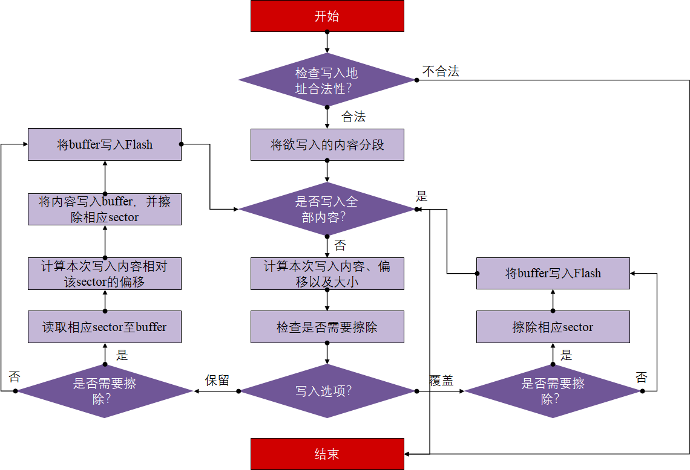

# 2021-03-15 ~ 2021-03-22 SylixOS&Driver&FS-Again

> 拖了三周，总算是完成NorFlash驱动了，相关用法见[08-SylixOS&Driver&FS-Continue-Part1](./08-SylixOS&Driver&FS-Continue-Part1.md)。本节主要介绍相关实现原理
>
> 参考文献：
>
> 1. [裸机操作S3C2440 NorFlash](https://blog.csdn.net/Mculover666/article/details/104115535)
> 2. [mini2440 NorFlash芯片手册](../Files/Am29LV160DB.pdf)
> 3. [S3C2440 NorFlash裸机编程](https://blog.csdn.net/m0_37633745/article/details/103188617)
> 4. [08-SylixOS&Driver&FS-Continue-Part1](./08-SylixOS&Driver&FS-Continue-Part1.md)
> 5. [06-SylixOSPractice-Part1.md](./06-SylixOSPractice-Part1.md)

## Am29LV160DB  NorFlash驱动实现原理

事实上，无论是`Fake`还是`True Nor`，它们的原理都基本相同。下面先从共性上来讲原理，再从特性上来讲。

### 共性

#### 读

读部分较为简单。因为**NorFlash**是**Ram-Like**器件，所以其与用**Ram**模拟的**Fake Nor**的读部分基本是一致的，都是直接获取相应地址的内容即可，关键代码如下：

```c
UINT8 read_byte_from_mem(UINT32 base, UINT32 offset){
	volatile UINT8* p = (volatile UINT8*)(base + offset);
	return *p;
}

UINT8 read_nor(UINT offset, PCHAR content, UINT size_bytes){
	...
	INT i;
	pretty_print("[nor read statue]", INFO "nor read start", DONT_CENTRAL);
	for (i = 0; i < size_bytes; i++)
	{
		*(content + i) = read_byte_from_mem(NOR_FLASH_BASE, offset + i);
	}
	pretty_print("[nor read statue]", INFO "nor read successfully", DONT_CENTRAL);
	return 0;
}

```

#### 写、擦除

> 这里将写与擦除结合起来写，因为擦除与写之间联系性较高，写通常要涉及到擦除操作。

这部分比较麻烦。有几个问题需要重点提出来：

1. **Am29LV160DB  NorFlash**的写入是将**1写为0**，而其擦除是将**0还原为1**。如果Flash上原本是**1**，那么写入**0或1**都不需要进行擦除操作；但是，如果Flash上原本是**0**，这时候写入**1**就需要先擦除、再写入了，而此时写入**0**也不需要进行擦除操作。绘制表格如下：

   | Flash介质\写入 |     1      |          0           |
   | :------------: | :--------: | :------------------: |
   |       0        |  需要擦除  |      不需要擦除      |
   |       1        | 不需要擦除 | 不需要擦除，直接写入 |

2. 如果**Am29LV160DB  NorFlash**的某个sector全为1，那么它是**干净**的，就不需要擦除；

3. 正如在[06-SylixOSPractice-Part1.md](./06-SylixOSPractice-Part1.md)一文中提到的那样，写入要涉及到是否覆盖原始sector中的内容，**因为NorFlash的擦除是以sector为单位进行的**；

接下来，可以针对上述三个问题，设计写入与擦除了。

##### 写入

基本流程如下图所示：



其中分段部分即计算写入的内容的**sector范围**，按照每个sector来进行写入，关键代码如下：

```c
UINT8 	start_sector_no = GET_SECTOR_NO(offset);
UINT8 	end_sector_no = GET_SECTOR_NO(offset + size_bytes - 1);
```

接下来计算每一次将要写入的内容偏移、大小，关键代码如下：

```c
UINT size_bytes_to_write;
PCHAR content_to_write;
UINT offset_to_write;
if(sector_no == start_sector_no){										/* 第一个sector */
    if(start_sector_no == end_sector_no){								/* 如果只写一个sector，那么就是写size_bytes */
        size_bytes_to_write = size_bytes;										
    }
    else {
        size_bytes_to_write = GET_SECTOR_OFFSET(sector_no + 1) - offset;/* 否则，写offset ~ 第一个sector结束的所有位置 */
    }
}
else if (sector_no == end_sector_no)									/* 最后一个sector */
{
    size_bytes_to_write = size_bytes - size_bytes_have_written;			/* 总共需要写的字节 减去 已经写入的字节 */
}
else {
    size_bytes_to_write = GET_SECTOR_SIZE(sector_no);					/* 写入一个sector大小 */
}
content_to_write = content + size_bytes_have_written;					/* 写入内容偏移量 */
offset_to_write = offset + size_bytes_have_written;						/* 写入位置偏移量 */
```

接着，通过**nor_check_should_erase** (**UINT32** base, **UINT** offset, **PCHAR** content, **UINT** size_bytes)检查是否应该擦除相应内容，这里涉及到一个算法。从前面的**表**中，我们可以看到，当且仅当**Flash**介质上是**0**，我们要写入**1**时才会需要擦除，根据这个特点，我们可以设计如下流程进行判断：

1. 假设要写入的字节**α**是 ：**A1 A2 ... A8**；

2. 假设Flash上将要写入的位置的字节**β**是：**A1' A2' ... A8'**；

3. 那么**字节t = A1 A2 ... A8 ^ A1' A2' ... A8**便记录了字节**α**与字节**β**的所有不同位；

   > 例如，00101011 ^ 00101001 = 00000010，不同位是从右往左第2位；

4. 因为从**表格**可知，二者相同时，不需要擦除，所以我们只需考察不同位即可。此时，**写入**和**被写入**的位置一定一个**1**一个**0**，而写入为1时，我们需要擦除，因此只需判断**字节t & 字节α == 0**即可。如果结果为0，那么说明不必擦除，否则需要擦除。

上述流程对应的代码如下：

```c
BOOL nor_check_should_erase(UINT32 base, UINT offset, PCHAR content, UINT size_bytes){
	INT i;
	for (i = 0; i < size_bytes; i++)
	{
		UINT8 byte_in_flash = read_byte_from_mem(base, offset + i);
		UINT8 byte_to_write = (UINT8)(*(content + i));
		UINT8 byte_diff = byte_in_flash ^ byte_to_write;
        ...
		if((byte_diff & byte_to_write) != 0){
			return TRUE;
		}
	}
	return FALSE;
}
```

接下来的内容将变得较为简单，相信代码能说明一切：

```c
switch (ops)
{
    case WRITE_OVERWRITE:{																/* 覆盖写，如果需要擦除则直接擦除 */
        UINT32 start_setcor_offset = GET_SECTOR_OFFSET(sector_no);
        if(is_sector_should_erased){
            erase_nor(start_setcor_offset, ERASE_SECTOR);
        }
        nor_write_buffer(NOR_FLASH_BASE, offset_to_write, content_to_write, size_bytes_to_write);
        break;	
    }
    case WRITE_KEEP:{
        UINT32 start_setcor_offset = GET_SECTOR_OFFSET(sector_no);						/* 保持写，如果需要擦除，则先保存整个sector，然后再将整个sector写入 */
        UINT sector_size = GET_SECTOR_SIZE(sector_no);
        if(is_sector_should_erased){
            PCHAR buffer = (PCHAR)lib_malloc(sector_size);								/* 读出sector的内容到buffer中 */
            read_nor(start_setcor_offset, buffer, sector_size);
            UINT bias_to_write = offset_to_write - start_setcor_offset;					/* 计算写入偏移相对该sector的偏移量 */
            lib_memcpy(buffer + bias_to_write, content_to_write, size_bytes_to_write);  /* 向buffer中写入要写的内容 */
            erase_nor(start_setcor_offset, ERASE_SECTOR);								/* 擦除sector */
            nor_write_buffer(NOR_FLASH_BASE, start_setcor_offset, buffer, sector_size);	/* 将buffer写入sector */
            lib_free(buffer);
        }
        else
        {
            nor_write_buffer(NOR_FLASH_BASE, offset_to_write, content_to_write, size_bytes_to_write);		/* 直接写入sector */
        }
        break;
    }
    default:
        break;
}
size_bytes_have_written += size_bytes_to_write;
```

其中，**nor_write_buffer**函数将针对不同的启动模式给出不同的写入操作，**Fake Nor**直接写入内存即可，而**True Nor**仅需按照**Data Sheet**时序写入即可，相关代码如下：

```c++
VOID nor_write_buffer(UINT32 base, UINT offset, PCHAR content, UINT size_bytes){
	UINT8 sector_no = GET_SECTOR_NO(offset);
	UINT32 sector_start_offset = GET_SECTOR_OFFSET(sector_no);
	UINT sector_remain_size = GET_SECTOR_SIZE(sector_no) - (offset - sector_start_offset); 
	if(size_bytes > sector_remain_size){
		pretty_print("[nor write buffer]", FAIL "size not permit", DONT_CENTRAL);
		return;
	}
	if(IS_FAKE_MODE()){
		PCHAR p = content;
		if(get_sector_is_bad(sector_no)){                                                /* 随机修改 */
			printf("| -> [sector #%d is bad, there may be some error(s), remember to check]\n", sector_no);
			PCHAR pe = p + size_bytes;
			for (; p < pe; p++)
			{
				INT possibily = rand() % 100 + 1;
				INT random_change = rand() % 127;                                        /* 0 ~ 127 ascii */
				if(possibily >= 50){													 /* 50%的几率写错 */
					*p += random_change;
				}
			} 
		}
		lib_memcpy((PVOID)(base + offset), content, size_bytes);
	}
	else{
		UINT size_words = size_bytes / 2;
		INT remain_byte = size_bytes - size_words * 2 ;
		INT i;
		for (i = 0; i < size_words; i++)
		{
			INT index = 2 * i;
			UINT32 data = content[index] + (content[index + 1] << 8);
			nor_command_unlock(base);
			write_word_to_mem(base, 0x555, 0xA0);
			write_word_to_mem(base, offset >> 1, data);
			wait_ready(base, offset);	   
			offset += 2;
		}
		if(remain_byte){
			UINT32 data = content[size_bytes - 1];
			nor_command_unlock(base);
			write_word_to_mem(base, 0x555, 0xA0);
			write_word_to_mem(base, offset >> 1, data);
			wait_ready(base, offset);	   
		}
	}
}
```

##### 擦除

擦除部分较为简单，只需判断相应sector是否需要擦除即可，流程图如下：


检查是否需要擦除，只需要检查该**sector**的内容是否**全为1**，因为**Nor Flash**干净状态就是**全1**。于是，相关判断代码如下：

```c
static inline BOOL IS_SECTOR_DIRTY(UINT32 base, UINT8 sector_no){
    INT i;
    if(sector_no < 0 || sector_no >= NOR_FLASH_NSECTOR){
        return TRUE;
    }
    UINT sector_size = GET_SECTOR_SIZE(sector_no);
    UINT32 addr = GET_SECTOR_OFFSET(sector_no) + base;
    volatile UINT8* p;
    for (i = 0; i < sector_size; i++)
    {
        p = (volatile UINT8*)(addr + i);
        if((*p & 0xFF) != 0xFF){
          return TRUE;
        }
    }
    return FALSE;
}
```

擦除部分代码如下，同样，分为**Fake**和**True**两种实现方式，其中，**Fake**模式下，只需设置相应sector对应的内存空间为全1即可，这里承接[06-SylixOSPractice-Part1](./06-SylixOSPractice-Part1.md)部分，还需要对该sector的**擦写次数**进行**加一**操作；**True**模式下，只需根据**Data Sheet**时序擦除即可。

```c
if(IS_FAKE_MODE()){
    UINT8 sector_no = GET_SECTOR_NO(offset);
    UINT32 sector_start_offset = GET_SECTOR_OFFSET(sector_no);
    UINT sector_size = GET_SECTOR_SIZE(sector_no);
    lib_memset((PVOID)(base + sector_start_offset), (INT)-1, sector_size);
    sector_infos[sector_no].erase_cnt++;
}
else{
    nor_command_unlock(NOR_FLASH_BASE);
    write_word_to_mem(NOR_FLASH_BASE,0x555, 0x80);	 
    nor_command_unlock(NOR_FLASH_BASE);
    write_word_to_mem(NOR_FLASH_BASE,offset >> 1, 0x30);	 	           /* 发出扇区地址 */ 
    wait_ready(NOR_FLASH_BASE, offset);									   /* 等待擦除完成 */
}
```

### 特性

#### 初始化

##### Fake实现

与[06-SylixOSPractice-Part1](./06-SylixOSPractice-Part1.md)部分相同，具体可参考该部分的内容；

##### True实现

SylixOS不支持直接操作物理内存，需要做地址映射。关键代码如下：

```c
NOR_FLASH_BASE = (UINT32)API_VmmIoRemap2(0, 2 * 1024 * 1024);
```

也就是说，与**Fake Nor**一样，**True Nor**的起始地址也并非**地址0**，而是从**NOR_FLASH_BASE**开始。

#### True Nor注意事项

1. 要从**NOR_FLASH_START_OFFSET**处开始擦除或者写入；
2. 擦除干净块会**提示错误**，然后终止擦除操作；
3. 擦除或写入**NOR_FLASH_START_OFFSET**之前的块会出现**no permission**错误，然后操作会被终止；
4. 在**True Nor**中，没有坏块管理一说，可以尝试用文件系统来记录每个块的擦写次数，但是，**目前看来，创建文件似乎失败了，还需要进一步的调整**；

#### Fake坏块生成

与[06-SylixOSPractice-Part1](./06-SylixOSPractice-Part1.md)部分相同，具体可参考该部分的内容；