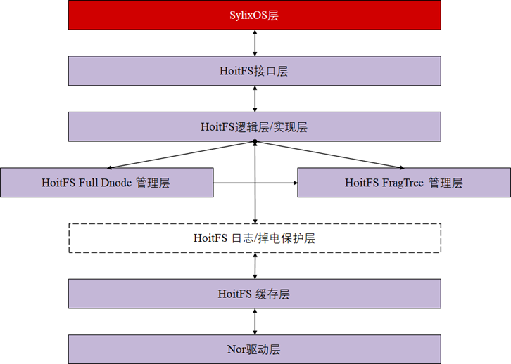

# 2021-04-07 ~ 2021-04-19 HoitFs 开发第二阶段

> 距离上次更新文档已经有一段日子了，这几天比较忙。4月7日到4月14日项目进展较小，仅做了简单的封装工作以及PPT的框架设计工作，项目进入中期[HoitFS中期答辩](../Files/PPT/hoitfs-middle-stage-presentation.pptx)。另外，架构做出了一定的调整，目前，GC逻辑将另增一个线程进行管理。
>
> 
>
> 
>
> 本周进入项目的联合调试阶段，本阶段的首要任务便是能够让HoitFs成功跑起来。

## hoitFsTree API DOC（*代表可忽略部分）

> 本部分实现FragTree相关代码，与HoitFs的**普通文件**直接关联，上至逻辑层，下至物理层，是关键的数据结构。

### 构造函数

- PHOIT_FRAG_TREE_NODE **newHoitFragTreeNode**(PHOIT_FULL_DNODE `pFDnode`, UINT32 `uiSize`, UINT32 `uiOfs`, UINT32 `iKey`)

  **函数说明：**本函数为FragTreeNode的构造函数，能够根据PHOIT_FULL_DNODE**（逻辑层结构）**建立相应的`FragTree`节点；

  **参数说明：**

  1. `pFDnode`

     PHOIT_FULL_DNODE类型节点；

  2. `uiSize`

     节点映射到逻辑层的**大小**，单位为**字节**；

  3. `uiOfs`

     节点映射到逻辑层的**偏移**，单位为**字节**；

  4. `iKey`

     关键字，FragTree根据关键字构建红黑树结构，**常常以uiOfs作为关键字**

  **用例说明：**

  ```c
  PHOIT_INODE_INFO pNewInode  	= (PHOIT_INODE_INFO)__SHEAP_ALLOC(sizeof(HOIT_INODE_INFO));
  pNewInode->HOITN_rbtree 		= hoitInitFragTree(pfs);
  PHOIT_FULL_DNODE pTempDnode 	= pDnodeList;
  PHOIT_FULL_DNODE pTempNext  	= LW_NULL;
  
  PHOIT_FRAG_TREE_NODE pTreeNode  = newHoitFragTreeNode(pTempDnode, 
                                                        pTempDnode->HOITFD_length, 
                                                        pTempDnode->HOITFD_offset, 
                                                        pTempDnode->HOITFD_offset);
  ```

  

- *PHOIT_FRAG_TREE_LIST_NODE **newFragTreeListNode**(PHOIT_FRAG_TREE_NODE `pFTn`)

  **函数说明：**本函数为`FragTree`**链表**的构造函数，当我们想要搜集FragTree上的节点时，PHOIT_FRAG_TREE_LIST_NODE将是把这些节点串接起来的数据结构；

  **参数说明：**

  1. `pFTn`

     PHOIT_FRAG_TREE_NODE类型，即FragTree上的节点；

  **用例说明（外界基本不会用到）：**

  ```c
  pFTlistNode = newFragTreeListNode(pFTnRoot);
  ```

### 核心方法接口

- PHOIT_FRAG_TREE	**hoitInitFragTree**(PHOIT_VOLUME pfs)

  **函数说明：**根据文件头创建FragTree

  **参数说明：**`pfs` - 文件头

  **返回说明：**PHOIT_FRAG_TREE数据结构

  **用例说明：**

  ```c
  PHOIT_INODE_INFO pNewInode = (PHOIT_INODE_INFO)__SHEAP_ALLOC(sizeof(HOIT_INODE_INFO));
  pNewInode->HOITN_rbtree = hoitInitFragTree(pfs);
  ```

- PHOIT_FRAG_TREE_NODE     **hoitFragTreeInsertNode**(PHOIT_FRAG_TREE `pFTTree`, PHOIT_FRAG_TREE_NODE `pFTn`)

  **函数说明：**向FragTree中插入一个节点

  **参数说明：**

  `pFTTree` - 目标FragTree

  `pFTn` - 目标节点

  **返回说明：**返回插入的节点；

  **用例说明：**

  ```c
  略
  ```

- *PHOIT_FRAG_TREE_NODE     **hoitFragTreeSearchNode**(PHOIT_FRAG_TREE `pFTTree`, INT32 `iKey`)

  **函数说明：**在FragTree上搜索键值为iKey的节点；

  **参数说明：**

  `pFTTree` - 目标FragTree

  `iKey` - 键值

  **返回说明：**找到的FragTreeNode

  **用例说明：**

  ```c
  PHOIT_FRAG_TREE                     pFTTree;
  PHOIT_FRAG_TREE_NODE                pFTn;
  PHOIT_VOLUME                        pfs;
  
  pfs = (PHOIT_VOLUME)lib_malloc(sizeof(HOIT_VOLUME));
  pFTTree = hoitInitFragTree(pfs);
  
  pFTn = hoitFragTreeSearchNode(pFTTree, 7);
  printf("pFTn - uiOfs : %d\n", pFTn->uiOfs);
  printf("pFTn - uiSize: %d\n", pFTn->uiSize);
  printf("pFTn - iKey  : %d\n", FT_GET_KEY(pFTn));
  ```

- BOOL             **hoitFragTreeDeleteNode**(PHOIT_FRAG_TREE `pFTTree`, PHOIT_FRAG_TREE_NODE `pFTn`, BOOL `bDoDelete`)

  **函数说明：**在FragTree上删除某个节点，并删除其指向的FullDnode节点，并释放其内存，注意保存

  **参数说明：**

  `pFTTree` - 目标FragTree

  `pFTn` - 待删除节点

  `bDoDelete` - 是否彻底删除？即删除RawInfo结构？

  **返回说明：**删除成功返回LW_TRUE，否则返回LW_FALSE

  **用例说明：**

  ```c
  hoitFragTreeDeleteNode(pFTTree, pFTn, LW_FALSE);
  ```

- BOOL             **hoitFragTreeDeleteRange**(PHOIT_FRAG_TREE `pFTTree`, INT32 `iKeyLow`, INT32 `iKeyHigh`, BOOL `bDoDelete`)

  **函数说明：**在FragTree上**“删除”**某范围内的节点（**注：**如果删除位置位于某个节点中间，则按照FixUp的方法进行调整，详情见**实现说明部分**）

  **参数说明：**

  `pFTTree` - 目标FragTree

  `iKeyLow` - 低键值

  `iKeyHigh` - 高键值

  `bDoDelete` - 是否删除RawInfo，并标记RawNode为过期节点

  **返回说明：**删除成功返回LW_TRUE，否则返回LW_FALSE

  **用例说明：**

  ```c
  //删除所有节点，并删除RawInfo
  hoitFragTreeDeleteRange(pFTTree, INT_MIN, INT_MAX, LW_LW_TRUE);
  ```

- BOOL             **hoitFragTreeDeleteTree**(PHOIT_FRAG_TREE `pFTTree`, BOOL `bDoDelete`)

  **函数说明：**删除FragTree上的所有节点，并且删除FragTree数据结构；

  **参数说明：**

  `pFTTree` - 目标FragTree

  `bDoDelete` - 是否彻底删除？即删除RawInfo结构？

  **返回说明：**删除成功返回LW_TRUE，否则返回LW_FALSE

  **用例说明：**

  ```c
  hoitFragTreeDeleteTree(pFTTree, LW_FALSE);
  ```

- *VOID             **hoitFragTreeTraverse**(PHOIT_FRAG_TREE `pFTTree`, PHOIT_FRAG_TREE_NODE `pFTnRoot`)

  **函数说明：**中序遍历FragTree

  **参数说明：**

  `pFTTree` - 目标FragTree

  `pFTnRoot`- 根节点

  **返回说明：**无

  **用例说明：**

  ```c
  //注意指针强转
  hoitFragTreeTraverse(pFTTree, (PHOIT_FRAG_TREE_NODE)pFTTree->pRbTree->pRbnRoot);
  ```

- PHOIT_FRAG_TREE_LIST_HEADER  **hoitFragTreeCollectRange**(PHOIT_FRAG_TREE `pFTTree`, INT32 `iKeyLow`, INT32 `iKeyHigh`)

  **函数说明：**在FragTree上搜索键值在范围[x, y]的节点，其中，x <= iKeyLow，y >= iKeyHigh，返回链表；

  **参数说明：**

  `pFTTree` - 目标FragTree

  `iKeyLow` - 低键值

  `iKeyHigh` - 高键值

  **返回说明：**返回链表头

  **用例说明：**

  ```c
  printf("\n 3. [test collect range [-∞, +∞] ] \n");
  //收集FragTree上所有节点
  pFTlistHeader = hoitFragTreeCollectRange(pFTTree, INT_MIN, INT_MAX);
  pFTlistNode = pFTlistHeader->pFTlistHeader->pFTlistNext;
  while (pFTlistNode)
  {
      printf("Key: %d\n", FT_GET_KEY(pFTlistNode->pFTn));   
      pFTlistNode = pFTlistNode->pFTlistNext;
  }
  printf("range [%d, %d] \n", pFTlistHeader->uiLowBound, pFTlistHeader->uiHighBound);
  ```

### 高级方法接口

- BOOL **hoitFragTreeRead**(PHOIT_FRAG_TREE `pFTTree`, UINT32 `uiOfs`, UINT32 `uiSize`, PCHAR `pContent`)

  **函数说明：**在FragTree上搜索从uiOfs起，uiSize大小的节点，并通过`Cache`层读取相应内容

  **参数说明：**

  `pFTTree` - 目标FragTree

  `uiOfs` - 起始偏移

  `uiSize` - 内容大小

  `pContent` - 读取内容

  **返回说明：**读取成功返回LW_TRUE， 读取失败返回LW_FALSE

  **用例说明：**

  ```c
  略
  ```

- BOOL **hoitFragTreeOverlayFixUp**(PHOIT_FRAG_TREE pFTTree)

  **函数说明：**修复FragTree上重叠的节点

  **参数说明：**

  `pFTTree` - 目标FragTree

  **返回说明：**有修复输出LW_TRUE，否则输出LW_FALSE

  **用例说明：**

  ```c
  略
  ```

## 基于JFFS2的GC设计

> 老生常谈：工欲善其事，必先利其器。这里找到了一个很好的[Code Thru网站](https://code.woboq.org/linux/linux/fs/jffs2/nodelist.h.html#jffs2_eraseblock)，接下来的任务便是查看EraseBlock定义了。

学习GC的写法，其实最重要的是学习数据结构的定义，然后便能够通过该数据结构来揣测整个GC流程。以下是`jffs2_eraseblock`结构

```c
struct jffs2_eraseblock
{
	struct list_head list;
	int bad_count;
	uint32_t offset;		/* of this block in the MTD */
	uint32_t unchecked_size;
	uint32_t used_size;
	uint32_t dirty_size;
	uint32_t wasted_size;
	uint32_t free_size;	/* Note that sector_size - free_size
				   is the address of the first free space */
	uint32_t allocated_refs;
	struct jffs2_raw_node_ref *first_node;
	struct jffs2_raw_node_ref *last_node;
	struct jffs2_raw_node_ref *gc_node;	/* Next node to be garbage collected */
};
```

核心代码在`gc.c/jffs2_garbage_collect_pass`函数中。


## 联调问题记录

